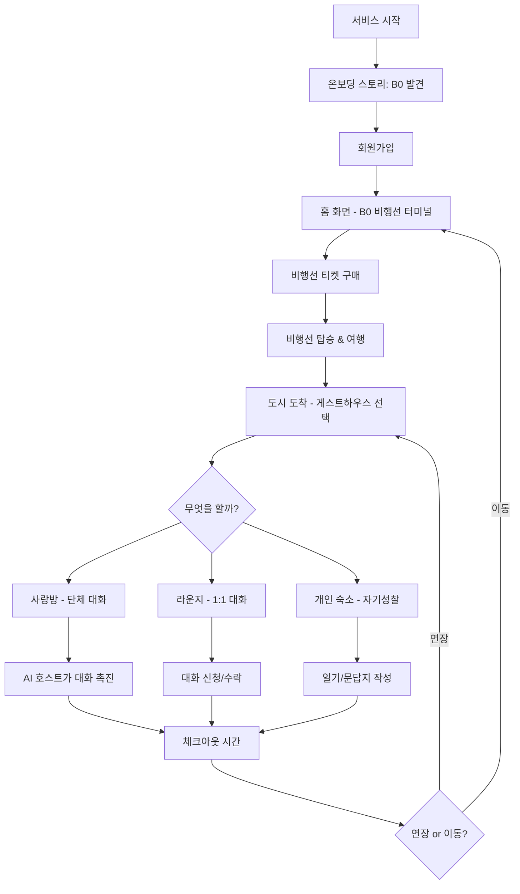

# 개발 로드맵 & 기능 명세

이 문서는 B0 서비스의 개발 로드맵을 Phase 1 (MVP)과 Phase 2 (확장 기능)으로 구분하여 정리한 문서입니다.

---

## Phase 1: MVP 필수 기능

8주간 개발하여 정식 런칭할 핵심 기능들입니다.

### 전체 기능 맵



---

### 개발 일정 및 시간 추정

| 기능                    | 예상 시간        | 우선순위  |
| --------------------- | ------------ | ----- |
| 1. 온보딩 & 회원가입         | 12h          | 🔴 필수 |
| 2. B0 비행선 터미널 & 도시 탐색 | 10h          | 🔴 필수 |
| 3. 비행선 티켓 구매 & 이동     | 15h          | 🔴 필수 |
| 4. 게스트하우스, 사랑방 & 라운지 | 45h          | 🔴 필수 |
| 5. AI 호스트             | 12h          | 🟡 중요 |
| 6. 개인 숙소              | 10h          | 🟡 중요 |
| 7. 포인트 시스템            | 8h           | 🔴 필수 |
| 8. 체크아웃 & 시간 시스템      | 10h          | 🔴 필수 |
| 9. 프로필 & 설정           | 8h           | 🟢 선택 |
| 10. 데이터 수집 & 기능 제어    | 10h          | 🔴 필수 |
| **개발 소계**             | **140h**     |       |
| 설계/디자인                | 30h          |       |
| 통합 테스트                | 20h          |       |
| 버그 수정                 | 30h          |       |
| 배포 준비                 | 10h          |       |
| **전체 합계**             | **230h**     |       |
| **가용 시간**             | **240h**     |       |
| **버퍼**                | **10h (4%)** |       |

---

### 기능 1: 온보딩 & 회원가입

**사용자 시나리오**: "서연이가 앱을 처음 실행하면, 방에서 신비한 핸드폰을 발견하고 B0(지하 0층)으로의 초대를 받는 짧은 이야기를 본 후 회원가입을 한다"

**상세 플로우**

1. **스토리 화면 1**: 방 안 침대 이미지 → "어느 날 밤, 당신은 의문의 핸드폰을 발견했습니다"
2. **스토리 화면 2**: 핸드폰 화면 클로즈업 → "화면에는 'B0'이라는 이상한 앱이 설치되어 있습니다"
3. **스토리 화면 3**: 비행선 터미널 이미지로 전환 → "B0 - 존재하지 않는 층, 숨겨진 비행선 터미널로의 초대"
4. **시작하기 버튼** 클릭
5. **로그인/회원가입 선택 화면**
6. **회원가입 플로우**
    - 이메일 입력 → 실시간 중복 확인 (포커스 아웃 시)
    - 비밀번호 입력 (8자 이상, 영문+숫자 조합)
    - 비밀번호 확인
    - 닉네임 입력 (2-10자) → 실시간 중복 확인
    - 프로필 이모지 선택 (😊 😎 🌟 🌈 등 10종)
    - 가입 완료 → 자동으로 1000포인트 지급
7. **로그인 플로우**
    - 이메일 입력
    - 비밀번호 입력
    - "로그인" 버튼

**입력**: 이메일, 비밀번호, 닉네임, 이모지
**처리**: 계정 생성, 중복 확인, 1000포인트 자동 지급
**출력**: 홈 화면 이동, "B0에 오신 것을 환영합니다! 1000포인트를 받았습니다" 메시지

**제약사항**

- 이메일은 중복 불가
- 닉네임은 중복 불가
- 닉네임은 2-10자 제한
- 욕설 및 부적절한 단어 필터링
- 비밀번호는 8자 이상, 영문+숫자 조합 필수
- 이모지는 선택 필수

**완료 조건**

- [ ] 3장의 스토리 이미지가 순서대로 보임 (B0 컨셉 반영)
- [ ] 회원가입이 정상적으로 완료됨
- [ ] 로그인이 정상적으로 작동함
- [ ] 가입 후 1000포인트가 자동 지급됨
- [ ] 이메일 중복 검사가 실시간으로 작동함
- [ ] 닉네임 중복 검사가 실시간으로 작동함
- [ ] 프로필 이모지가 저장됨

**예상 개발 시간**: 12시간

---

### 기능 2: B0 비행선 터미널 & 도시 탐색

**사용자 시나리오**: "서연이가 B0 비행선 터미널에서 6개 도시를 구경하고, 관계에 대해 생각해보고 싶어서 '세렌시아' 행 비행선을 선택한다"

**상세 플로우**

1. 홈 화면 진입 → 상단에 B0 비행선 터미널 전광판 표시
2. 하단에 도시 카드 (좌우 스와이프 가능)
3. 카드를 넘기면 전광판에서 해당 도시 노선이 강조됨
4. 도시 카드 정보:
    - 도시 이미지 (배경)
    - 도시 이름
    - 테마 (예: "관계의 도시")
    - 한 줄 설명
    - "자세히 보기" 버튼
    - "비행선 티켓 예매" 버튼
5. "자세히 보기" 클릭 → 도시 상세 정보 팝업
6. "비행선 티켓 예매" 클릭 → 예매 화면으로 이동

**입력**: 카드 스와이프, 버튼 클릭  
**처리**: 전광판에서 선택된 도시 노선 강조  
**출력**: 도시 정보 표시, 예매 화면 이동

**제약사항**

- 총 6개 도시 제공 (단계적 오픈)
- Week 1-4: 세렌시아, 로렌시아 먼저 오픈
- Week 5-8: 나머지 4개 도시 순차 오픈
- 오픈되지 않은 도시는 "준비중" 표시

**완료 조건**

- [ ] B0 터미널 전광판이 정상 표시됨
- [ ] 카드 스와이프가 부드럽게 작동함
- [ ] 선택한 도시 노선이 전광판에서 강조됨
- [ ] 6개 도시의 이미지와 설명이 모두 준비됨
- [ ] "자세히 보기"에서 도시 정보가 잘 보임

**예상 개발 시간**: 10시간

---

### 기능 3: 비행선 티켓 구매 & 이동

**사용자 시나리오**: "서연이가 세렌시아행 고속비행선을 선택하고 500포인트를 결제한 후, 비행선을 타고 이동한다"

**상세 플로우**

1. **비행선 티켓 예매 화면**
    - 출발지: B0 비행선 터미널
    - 도착지: 선택한 도시명
    - 오늘 날짜 기준 빠른 출발 시간 순으로 리스트 표시
2. **비행선 선택**
    - 일반 비행선: 300P, 소요시간 30분
    - 고속 비행선: 500P, 소요시간 10분
3. **결제 화면**
    - 필요 포인트 표시
    - 보유 포인트 표시
    - 결제 후 잔액 표시
    - "결제하기" 버튼
4. 결제 완료 → 티켓 화면으로 이동
5. **티켓 화면**
    - 비행선 탑승권 스타일 디자인
    - 출발(B0)/도착 정보
    - 비행선 번호 (장식용)
    - 도착 예정 시간 카운트다운
6. 도착 시간이 되면 자동으로 게스트하우스 선택 화면으로 이동
7. 이동 중 비행선 비행 애니메이션 표시 (구름 사이로 날아가는 효과, 이세계 풍경)

**입력**: 비행선 선택, 결제 확인  
**처리**: 포인트 차감, 티켓 발급, 도착 시간 계산  
**출력**: 티켓 화면, 자동 이동

**제약사항**

- 포인트가 부족하면 결제 불가
- 포인트 부족 시 "포인트가 부족합니다. 일기를 쓰거나 대화에 참여해보세요" 안내
- 오늘 날짜만 선택 가능
- 출발 시간은 현재 시간 이후만 가능
- 일반 비행선: 출발 후 30분 뒤 도착
- 고속 비행선: 출발 후 10분 뒤 도착

**완료 조건**

- [ ] 비행선 시간표가 정확히 표시됨
- [ ] 포인트 결제가 정상 작동함
- [ ] 포인트 부족 시 안내 메시지 표시
- [ ] 티켓이 제대로 발급됨
- [ ] 도착 시간에 자동으로 화면 전환됨
- [ ] 비행선 비행 애니메이션이 자연스러움

**예상 개발 시간**: 15시간

---

### 기능 4: 게스트하우스 선택, 사랑방 & 라운지

**사용자 시나리오**: "서연이가 세렌시아에 도착하면 게스트하우스 유형을 선택한다. 오늘은 사람들과 활발하게 이야기하고 싶어서 '혼합형'을 선택하고 사랑방에 들어가니 5명이 이미 대화 중이다. 대화 카드를 뽑아 질문을 던지고 다른 사람들과 이야기를 나눈다. 한 사람과 좀 더 깊은 대화를 나누고 싶어서 라운지로 이동해 1:1 대화를 시작한다"

**상세 플로우**

1. **게스트하우스 유형 선택**
    - 옵션 1: "혼합형 게스트하우스"
        - 설명: "AI 호스트가 대화를 이끌어줘요"
        - "사람들과 활발하게 이야기하고 싶을 때"
    - 옵션 2: "조용한 방 게스트하우스"
        - 설명: "개인적인 대화와 성찰에 집중해요"
        - "차분하게 대화하고 나만의 시간을 보내고 싶을 때"
    - 선택에 따라 다른 게스트하우스로 배정
2. **게스트하우스 자동 룸 배정 (서버 로직)**
    - 사용자 입장 시 해당 도시/유형의 활성 채팅룸 조회
    - 6명 미만인 룸이 있으면 → 해당 룸에 배정
    - 모든 룸이 6명이면 → 새 룸 생성 후 배정
    - 사용자 화면에는 "세렌시아 혼합형 게스트하우스"로만 표시
    - 실제 룸 ID는 숨김 (예: 세렌시아_혼합_room_001)
3. **게스트하우스 거실 도착**
    - 도시별 배경 이미지 (노을 지는 항구 마을 등)
    - AI 호스트 환영 메시지: "세렌시아 [혼합형/조용한 방] 게스트하우스에 오신 것을 환영합니다!"
    - 도시 소개 문구 + 게스트하우스 유형 안내
    - 버튼: "사랑방 가기", "라운지", "개인 숙소"
4. **사랑방 입장**
    - 화면 상단: 현재 참여자 수 (예: "5명이 대화 중")
    - 채팅 메시지 리스트 (최근 100개 메시지 로드)
    - 메시지 입력창
    - 대화 카드 버튼 (🎴)
5. **채팅 히스토리 로드**
    - 입장 시 최근 100개 메시지 표시
    - 위로 스크롤 → 이전 메시지 50개씩 추가 로드 (페이지네이션)
    - 7일 이전 메시지는 자동 삭제됨
6. **메시지 전송**
    - 텍스트 입력 후 전송 버튼 클릭
    - 메시지가 즉시 화면에 표시됨
    - 다른 사람도 실시간으로 볼 수 있음
7. **대화 카드 사용**
    - 🎴 버튼 클릭 → 20장 중 랜덤 1장 뽑기
    - 카드 내용 팝업으로 표시
    - "카드 공유" 버튼 클릭
    - 채팅방에 카드 질문이 공유됨
    - 다른 사람들이 그 질문에 답변
8. **감정 반응**
    - 각 메시지 옆에 반응 버튼: 👍😢❤️🔥
    - 버튼 클릭 시 반응 추가
    - 같은 반응 여러 명 가능
    - 메시지 옆에 "❤️ 3" 형태로 표시
9. **신고/차단 기능**
    - 메시지 길게 누르기 → "신고하기" 옵션
    - 신고 사유 선택: 욕설/비방, 스팸/광고, 부적절한 내용, 기타
    - 신고 접수 → 관리자 대시보드에 기록
    - 사용자 닉네임 클릭 → "차단하기" 옵션
    - 차단 시 해당 사용자의 메시지 안 보임 (클라이언트 필터링)
    - 차단 목록은 프로필 > 설정에서 관리 가능
10. **라운지 (1:1 대화)**
    - 거실에서 "라운지" 버튼 클릭
    - 같은 게스트하우스에 있는 사용자 리스트 표시
    - 사용자 정보: 닉네임, 이모지, 현재 상태 (사랑방 중/개인 숙소 중)
    - "대화 신청" 버튼
    - 상대방에게 알림 전송: "[닉네임]님이 대화를 신청했습니다"
    - 상대방이 수락하면 1:1 채팅방 생성
    - 상대방이 거절하면 "상대방이 대화를 거절했습니다" 메시지
    - 1:1 채팅방:
        - 실시간 메시지 전송/수신
        - 메시지 히스토리 (최근 100개)
        - 대화 나가기 버튼
        - 신고/차단 기능 동일 적용
    - 대화 신청 수신 시:
        - 팝업: "[닉네임]님이 대화를 신청했습니다"
        - "수락" / "거절" 버튼
    - 동시에 여러 1:1 대화 가능 (최대 3개)
    - 1:1 대화 목록은 라운지에서 확인 가능

**입력**: 게스트하우스 유형 선택, 텍스트 메시지, 대화 카드 선택, 감정 반응 클릭, 신고/차단, 대화 신청/수락/거절
**처리**: 실시간으로 모든 참여자에게 전송, 저장, 6명 룸 자동 분배, 1:1 채팅방 생성 및 매칭
**출력**: 채팅 화면에 즉시 반영, 신고 접수 확인, 대화 신청 알림

**제약사항**

- 한 채팅 룸당 최대 6명
- 6명 초과 시 자동으로 새 룸 생성 및 배정
- 사용자는 룸 번호를 볼 수 없음 (같은 게스트하우스로 표시)
- 메시지는 최대 500자
- 욕설 및 부적절한 내용 필터링
- 스팸 방지: 10초에 1회 전송 제한
- 대화 카드는 1시간에 3장까지 사용 가능
- 채팅 히스토리는 7일간 보관
- 신고된 사용자는 관리자 검토 대상
- 차단 목록은 사용자당 최대 20명
- 동시 1:1 대화는 최대 3개까지
- 1:1 대화는 같은 게스트하우스 내에서만 가능
- 대화 신청은 1분에 3회까지 제한 (스팸 방지)
- 차단된 사용자와는 1:1 대화 불가

**완료 조건**

- [ ] 게스트하우스 유형 선택 화면이 표시됨
- [ ] 6명 룸 자동 분배 로직이 작동함
- [ ] 게스트하우스 배경이 도시별로 다르게 표시됨
- [ ] AI 호스트 환영 메시지가 표시됨
- [ ] 채팅 메시지가 실시간으로 전송됨
- [ ] 채팅 히스토리가 정상 로드됨 (최근 100개)
- [ ] 이전 메시지 페이지네이션이 작동함
- [ ] 7일 이전 메시지가 자동 삭제됨
- [ ] 대화 카드를 뽑을 수 있음
- [ ] 카드가 채팅방에 공유됨
- [ ] 감정 반응이 정상 작동함
- [ ] 신고 기능이 작동함
- [ ] 차단 기능이 작동함
- [ ] 부적절한 내용 필터링 작동
- [ ] 라운지에서 같은 게스트하우스 사용자 리스트가 표시됨
- [ ] 1:1 대화 신청/수락/거절이 작동함
- [ ] 1:1 채팅방이 정상 생성됨
- [ ] 1:1 메시지가 실시간 전송됨
- [ ] 동시 1:1 대화 제한(3개)이 작동함
- [ ] 차단된 사용자와 1:1 대화가 차단됨

**예상 개발 시간**: 45시간

---

### 기능 5: AI 호스트 (간소화)

**사용자 시나리오**: "사랑방에서 한동안 아무도 말을 하지 않자, AI 호스트가 대화 내용을 분석해 '요즘 날씨가 쌀쌀한데, 따뜻한 음료 중에 뭘 제일 좋아하세요?'라고 자연스러운 질문을 던져 대화를 이끈다"

**상세 플로우**

1. **환영 인사** (게스트하우스 입장 시):

    - "세렌시아 게스트하우스에 오신 것을 환영합니다!"
    - "이곳은 관계에 대해 생각해볼 수 있는 따뜻한 공간이에요"
    - (혼합형인 경우) "AI 호스트가 대화를 이끌어드릴게요"
    - (조용한 방인 경우) "편안하게 쉬시고 다른 여행자들과 차분한 대화를 나눠보세요"
2. **대화 촉진** (사랑방에서):

    - 5분간 메시지가 없으면 자동으로 AI 호스트 개입
    - 최근 대화 내용 분석 (Ollama 사용)
    - 대화 맥락에 맞는 자연스러운 질문 생성
    - 예시:
        - 대화 맥락 없음: "다들 어떤 하루를 보내셨나요?"
        - 대화에 '일', '회사' 언급: "요즘 일하면서 보람을 느낄 때는 언제인가요?"
        - 대화에 '여행', '휴가' 언급: "가장 기억에 남는 여행지는 어디였나요?"
3. **AI 호스트 응답 생성 로직**:

    ```
    [입력]
    - 최근 10개 메시지 (대화 맥락)
    - 현재 도시 테마 (예: 세렌시아 = 관계)
    - 게스트하우스 유형 (혼합형/조용한 방)
    - 무대화 시간 (5분)
    
    [Ollama 프롬프트]
    "당신은 따뜻하고 친절한 게스트하우스 호스트입니다. 
    최근 대화 내용을 보고, 대화를 자연스럽게 이어갈 수 있는 
    질문을 1개만 생성해주세요. 질문은 도시 테마(관계)와 
    관련이 있으면 좋습니다. 너무 무겁지 않고 편안한 톤으로."
    
    [출력]
    - 생성된 질문 1개
    - 채팅방에 AI 호스트 메시지로 전송
    ```

4. **AI 개입 제한**:

    - 대화가 활발하면 개입하지 않음
    - 혼합형 게스트하우스에서만 적극 개입
    - 조용한 방에서는 환영 메시지만 (대화 촉진 없음)
    - 5분 무대화 시 1회만 개입 (연속 개입 방지)

**입력**: 대화 내용, 시간, 게스트하우스 유형, 도시 테마  
**처리**: Ollama를 통한 대화 분석 및 질문 생성  
**출력**: 채팅 메시지 (AI 호스트)

**제약사항**

- AI 응답은 자연스럽고 친근한 톤 유지
- 과도한 개입 지양 (대화가 활발하면 개입 안 함)
- 조용한 방에서는 대화 촉진 기능 비활성화
- Ollama 서버 응답 시간 최적화 (1-2초 이내)
- 동시 요청 처리 능력 확보
- AI 응답 실패 시 미리 정의된 기본 질문 사용

**기술 스택**

- AI 엔진: Ollama (자체 호스팅)
- 모델: llama3 또는 유사 경량 모델
- 비용: 무료 (서버 리소스만 관리)
- 상한선: 없음

**완료 조건**

- [ ] 환영 메시지가 입장 시 표시됨 (게스트하우스 유형별로 다르게)
- [ ] 5분 무대화 시 AI 호스트가 질문을 던짐
- [ ] Ollama가 대화 맥락을 분석해 관련 질문 생성
- [ ] 혼합형에서만 대화 촉진이 작동함
- [ ] 조용한 방에서는 환영 메시지만 표시됨
- [ ] AI 응답이 자연스럽고 적절함
- [ ] AI 응답 속도가 2초 이내
- [ ] AI 응답 실패 시 기본 질문으로 대체

**예상 개발 시간**: 12시간

---

### 기능 6: 개인 숙소 (간소화)

**사용자 시나리오**: "서연이가 개인 숙소에 들어가 오늘 하루를 돌아보며 일기를 쓰고, 도시의 문답지에 답하며 자신을 성찰한다"

**상세 플로우**

1. **개인 숙소 입장**

    - 1인실 배경 이미지
    - 버튼: "일기 쓰기", "문답지", "사랑방 가기", "라운지"
2. **일기 쓰기**

    - 오늘 날짜 자동 표시
    - 제목 입력 (선택)
    - 본문 입력 (자유롭게, 500자 제한)
    - 기분 선택: 😊😐😢😠🥰 등
    - "저장" 버튼 → 50포인트 획득
    - 하루 1회만 포인트 획득 (여러 개 작성 가능, 포인트는 1회만)
    - **과거 일기 조회 기능 없음** (저장만 가능)
3. **문답지 작성**

    - 도시별 질문 3개 제공 (5개 → 3개로 축소)
    - 예) 세렌시아:
        - "요즘 나에게 힘이 되어주는 사람은?"
        - "최근에 누군가와 나눈 의미 있는 대화는?"
        - "관계에서 내가 가장 중요하게 생각하는 것은?"
    - 질문별로 답변 입력 (각 200자 제한)
    - 이전/다음 버튼으로 질문 이동
    - 3개 모두 작성 후 "제출" → 50포인트 획득
    - 도시별 1회만 작성 가능
    - **과거 문답지 조회 기능 없음** (저장만 가능)

**입력**: 일기 텍스트, 문답지 답변  
**처리**: 저장, 포인트 지급  
**출력**: 저장 완료 메시지, 포인트 획득 알림

**제약사항**

- 일기는 하루에 1개만 포인트 획득 (여러 개 작성 가능, 포인트는 1회만)
- 문답지는 도시별로 1회만 작성 가능
- 이미 작성한 문답지는 수정 불가 (재작성 불가)
- 일기와 문답지는 본인만 볼 수 있음 (비공개)
- 과거 일기/문답지 조회 기능 없음 (MVP 제외, Phase 2 예정)
- 명상 기능 제외 (MVP 제외, Phase 2 예정)
- 일기 본문 최대 500자
- 문답지 답변 각 200자

**완료 조건**

- [ ] 일기를 쓰고 저장할 수 있음
- [ ] 일기 작성 시 포인트가 지급됨
- [ ] 도시별 문답지 질문 3개가 표시됨
- [ ] 문답지 작성 시 포인트가 지급됨
- [ ] 중복 포인트 지급이 방지됨
- [ ] 일기와 문답지가 DB에 저장됨

**예상 개발 시간**: 10시간

---

### 기능 7: 포인트 시스템

**사용자 시나리오**: "서연이가 일기를 쓰고, 문답지를 작성하며 포인트를 모아서 다음 도시로 이동한다"

**상세 플로우**

1. **포인트 획득**

    - 회원가입: 1000P (자동)
    - 일기 작성: 50P (하루 1회)
    - 문답지 완성: 50P (도시별 1회)
    - (향후 확장: 출석, 대화 참여 등)
2. **포인트 사용**

    - 일반 비행선: 300P
    - 고속 비행선: 500P
    - 숙박 연장: 300P (1일)
3. **포인트 내역 조회**

    - 프로필 화면에서 "포인트 내역" 클릭
    - 날짜별 획득/사용 내역 리스트
    - "획득", "사용" 구분 표시
    - 잔액 변동 기록
4. **잔액 표시**

    - 모든 화면 상단에 현재 포인트 표시
    - 실시간 업데이트

**입력**: 포인트 획득/사용 이벤트  
**처리**: 잔액 계산, 내역 저장, 트랜잭션 관리  
**출력**: 잔액 표시, 내역 리스트

**제약사항**

- 포인트는 음수가 될 수 없음
- 포인트 부족 시 결제 불가
- 같은 활동으로 중복 획득 방지 (일기, 문답지 등)
- 환불 기능 없음
- 트랜잭션 처리로 동시성 문제 해결

**완료 조건**

- [ ] 포인트가 정확히 지급됨
- [ ] 포인트가 정확히 차감됨
- [ ] 잔액이 실시간으로 표시됨
- [ ] 포인트 내역을 조회할 수 있음
- [ ] 중복 지급이 방지됨
- [ ] 음수 잔액이 방지됨
- [ ] 동시성 문제가 발생하지 않음

**예상 개발 시간**: 8시간

---

### 기능 8: 체크아웃 & 시간 시스템

**사용자 시나리오**: "서연이가 세렌시아에서 하루를 보낸 후, 다음 날 정오가 되자 체크아웃 안내를 받고 연장할지 B0로 돌아가 다른 도시로 이동할지 선택한다"

**상세 플로우**

1. **시간 동기화**

    - 가상 세계 시간 = 한국 실제 시간 (KST)
    - 서버 시간 기준으로 통일
2. **자동 체크아웃** (매일 정오 12:00)

    - 11:50 알림: "10분 후 체크아웃입니다"
    - 12:00 팝업
        - "체크아웃 시간입니다"
        - 옵션 1: "숙박 연장 (300P)"
        - 옵션 2: "B0로 돌아가기"
3. **연장 선택**

    - 300P 차감
    - "1일 연장되었습니다" 메시지
    - 다음 날 12:00까지 체류 가능
4. **이동 선택**

    - B0 비행선 터미널(홈 화면)로 자동 이동
    - "다음 여행지를 선택해주세요" 메시지
5. **연장하지 않은 경우**

    - 12:00 이후 자동으로 B0로 복귀
    - "체크아웃되었습니다. B0로 돌아왔습니다" 메시지

**입력**: 체크아웃 시간, 사용자 선택  
**처리**: 연장 또는 이동 처리, 스케줄러 관리  
**출력**: 알림, 화면 전환

**제약사항**

- 체크아웃 시간은 매일 정오 12:00 고정
- 연장은 1일 단위만 가능
- 연장 비용은 300P 고정
- 포인트 부족 시 연장 불가
- 연장하지 않으면 강제 체크아웃 후 B0로 복귀

**완료 조건**

- [ ] 매일 12:00에 체크아웃 알림이 표시됨
- [ ] 11:50에 10분 전 알림이 표시됨
- [ ] 연장 선택 시 포인트가 차감됨
- [ ] 이동 선택 시 B0로 이동됨
- [ ] 연장하지 않으면 자동으로 B0로 이동됨
- [ ] 시간이 정확히 동기화됨
- [ ] 스케줄러가 안정적으로 작동함

**예상 개발 시간**: 10시간

---

### 기능 9: 프로필 & 설정

**사용자 시나리오**: "서연이가 자신의 프로필을 보고 여행 기록을 확인하며, 닉네임을 변경한다"

**상세 플로우**

1. **프로필 보기**

    - 닉네임
    - 프로필 이모지
    - 포인트 잔액
    - 여행 기록 (방문한 도시, 횟수)
    - 가입 날짜
2. **프로필 수정**

    - "수정" 버튼 클릭
    - 닉네임 변경 가능 (30일에 1회 제한)
    - 이모지 변경 가능
    - "저장" 버튼
3. **여행 히스토리**

    - 방문한 도시 리스트
    - 도시별 방문 횟수
    - 도시별 체류 일수
4. **설정**

    - 알림 설정 (체크아웃 알림 ON/OFF)
    - 차단 목록 관리
    - 로그아웃
    - (회원탈퇴는 Phase 2에서)

**입력**: 수정할 정보, 설정 변경  
**처리**: 정보 업데이트, 저장  
**출력**: 업데이트된 프로필

**제약사항**

- 닉네임 변경은 30일에 1회만 가능
- 닉네임 중복 검사 필수
- 로그아웃 시 진행 중인 채팅 종료
- 차단 목록 최대 20명

**완료 조건**

- [ ] 프로필 정보가 정확히 표시됨
- [ ] 닉네임을 변경할 수 있음 (30일 제한)
- [ ] 이모지를 변경할 수 있음
- [ ] 여행 기록이 표시됨
- [ ] 알림 설정이 작동함
- [ ] 차단 목록을 관리할 수 있음
- [ ] 로그아웃이 정상 작동함

**예상 개발 시간**: 8시간

---

### 기능 10: 데이터 수집 & 기능 제어

**사용자 시나리오**: "팀이 사용자 행동 데이터를 보고 '대화 카드' 기능의 효과를 분석한 후, 특정 카드를 비활성화하기로 결정한다"

**상세 플로우**

1. **주요 행동 추적**

    - 로그인/로그아웃 시간
    - 도시 선택 (어떤 도시가 인기?)
    - 비행선 티켓 구매 (일반 vs 고속)
    - 게스트하우스 유형 선택 (혼합형 vs 조용한 방)
    - 채팅 메시지 전송 개수 (내용은 제외)
    - 대화 카드 사용 횟수
    - 일기/문답지 작성 여부 (내용은 제외)
    - 체크아웃 시 선택 (연장 vs 이동)
    - 평균 체류 시간
    - 신고 횟수
2. **기능 켜고 끄기**

    - 관리자 페이지에서 기능별 ON/OFF 설정
    - 예: "대화 카드 기능" OFF → 사용자 화면에서 버튼 숨김
    - 예: "AI 호스트 대화 촉진" OFF → 환영 메시지만 표시
    - 코드 변경 없이 즉시 반영
3. **분석 대시보드**

    - 일별/주별 사용자 수
    - 도시별 인기도
    - 게스트하우스 유형별 선호도
    - 평균 체류 시간
    - 대화 활성도 (메시지 수)
    - 포인트 획득/사용 패턴

**입력**: 사용자 행동  
**처리**: 데이터 저장, 분석, 기능 토글  
**출력**: 대시보드 그래프, 기능 제어

**제약사항**

- 개인정보는 암호화하여 저장
- 민감한 내용(일기, 문답지, 채팅 내용)은 수집하지 않음
- 데이터는 서비스 개선 목적으로만 사용
- 사용자에게 데이터 수집 고지 (회원가입 시 동의)

**완료 조건**

- [ ] 주요 행동이 추적됨
- [ ] 대시보드에서 데이터를 볼 수 있음
- [ ] 기능 ON/OFF가 즉시 반영됨
- [ ] 개인정보가 보호됨
- [ ] 채팅/일기 내용은 수집되지 않음

**예상 개발 시간**: 10시간

---

## 사용자 플로우 (핵심 시나리오)

### 시나리오 1: 첫 방문 - 대화 중심 사용자

**사용자**: 민수(26세, 회사원, 퇴근 후) **목표**: 사람들과 대화하고 싶음 **소요 시간**: 약 45분

```
[단계 1] 앱 다운로드/접속 (1분)
 → 온보딩 스토리 3장 보기 (B0 발견)
 → "시작하기" 클릭

[단계 2] 회원가입 (2분)
 → 이메일 입력 (중복 확인)
 → 비밀번호 입력
 → 닉네임: "민수" 입력 (중복 확인)
 → 이모지: 😊 선택
 → 1000P 획득 메시지

[단계 3] B0 비행선 터미널 - 도시 탐색 (3분)
 → 도시 카드 좌우로 넘기며 구경
 → 세렌시아 "자세히 보기" 클릭
 → "관계의 도시" 설명 읽기
 → "비행선 티켓 예매" 클릭

[단계 4] 비행선 티켓 구매 (2분)
 → 고속 비행선 선택 (500P)
 → 결제 확인
 → 티켓 화면 확인
 → 10분 대기 (비행선 비행 애니메이션)

[단계 5] 게스트하우스 도착 & 선택 (1분)
 → 게스트하우스 유형 선택
 → "혼합형" 선택 (AI 호스트 대화 촉진)
 → 자동으로 6명 이하 룸에 배정
 → 노을 배경 이미지
 → AI 호스트 환영 메시지
 → "사랑방 가기" 클릭

[단계 6] 사랑방에서 대화 (30분)
 → 최근 100개 메시지 로드
 → 5명이 이미 대화 중
 → "안녕하세요!" 인사
 → 다른 사람들과 인사 주고받기
 → 대화 카드 뽑기: "요즘 내가 웃었던 순간은?"
 → 카드 공유하고 답변
 → 다른 사람 메시지에 ❤️ 반응
 → 5분 무대화 → AI 호스트가 자연스러운 질문 던짐
 → 대화 이어가기

[단계 7] 종료 (1분)
 → "내일 또 올게요~" 인사
 → 앱 종료
```

---

### 시나리오 2: 자기성찰 중심 사용자

**사용자**: 서연(28세, 마케터, 저녁 시간) **목표**: 하루를 돌아보고 싶음 **소요 시간**: 약 25분

```
[단계 1] 로그인 (1분)
 → 이메일로 로그인
 → 포인트: 650P 확인

[단계 2] 로렌시아 선택 (2분)
 → B0 터미널에서 "회복의 도시" 카드 확인
 → 일반 비행선 선택 (300P)
 → 30분 대기하며 다른 일

[단계 3] 게스트하우스 도착 & 선택 (1분)
 → "조용한 방" 선택 (성찰 중심)
 → 숲 속 오두막 배경
 → AI 호스트: "편안하게 쉬시고 차분한 대화를 나눠보세요"
 → "개인 숙소" 클릭

[단계 4] 개인 숙소에서 성찰 (20분)
 
 [문답지 작성] (8분)
 → "문답지" 클릭
 → 질문 1: "요즘 나를 지치게 하는 것은?"
 → 답변: "야근과 성과 압박..."
 → 질문 2-3도 차례로 답변
 → "제출" 클릭
 → 50P 획득
 
 [일기 쓰기] (10분)
 → "일기 쓰기" 클릭
 → 제목: "지친 하루"
 → 본문: 오늘 있었던 일과 감정 작성
 → 기분: 😢 선택
 → "저장" 클릭
 → 50P 획득

[단계 5] 종료 (1분)
 → 마음이 조금 가벼워짐
 → 앱 종료
```

---

### 시나리오 3: 여러 도시 탐험 사용자

**사용자**: 지훈(30세, 디자이너, 주말) **목표**: 여러 도시를 경험해보고 싶음 **소요 시간**: 3일간

```
[1일차 - 세렌시아]
 → 혼합형 게스트하우스 선택
 → 관계에 대한 대화 참여
 → AI 호스트가 대화 이끌어줌
 → 일기 작성으로 50P 획득

[2일차 - 체크아웃]
 → 정오 12:00 알림
 → "B0로 돌아가기" 선택
 → B0 터미널로 복귀

[2일차 - 로렌시아]
 → 일반 비행선으로 이동 (300P)
 → 조용한 방 게스트하우스 선택
 → 개인 숙소에서 문답지 작성
 → 사랑방에서 조용한 대화

[3일차 - 체크아웃]
 → 정오 12:00 알림
 → "숙박 연장" 선택 (300P)
 → 하루 더 로렌시아에 체류
 → 다른 여행자들과 계속 대화
```

---

## Phase 2: 확장 기능

Phase 1 (MVP) 런칭 이후 사용자 피드백을 반영하여 순차적으로 추가할 기능들입니다.

### 기능 1: 구조화된 이벤트 (불멍, 별멍 등)

**목적**: 혼합형 게스트하우스에서 정해진 시간에 함께하는 이벤트를 통해 몰입감과 소속감 강화

**상세 플로우**

1. **이벤트 스케줄**
   - 도시별로 특정 시간에 이벤트 진행
   - 예: 세렌시아 - 매일 20:00 "불멍의 시간"
   - 예: 로렌시아 - 매일 22:00 "별멍의 시간"
   - 이벤트 30분 전 알림

2. **이벤트 진행**
   - 이벤트 시간에 사랑방 배경이 이벤트 테마로 변경
   - 불멍: 모닥불 이미지, 따뜻한 분위기
   - 별멍: 밤하늘 별 이미지, 고요한 분위기
   - AI 호스트가 이벤트 시작 안내
   - 이벤트 관련 대화 카드 제공

3. **이벤트 참여**
   - 이벤트 중 채팅 참여 시 추가 포인트 (20P)
   - 이벤트 전용 배경음악 (선택적)
   - 30분간 진행 후 자동 종료

**예상 개발 시간**: 15시간

---

### 기능 2: 과거 일기/문답지 조회

**목적**: 사용자가 자신의 성장과 변화를 돌아볼 수 있는 기능

**상세 플로우**

1. **일기 조회**
   - 개인 숙소에서 "일기 보기" 버튼 추가
   - 날짜별 일기 리스트
   - 캘린더 뷰로 작성한 날짜 확인
   - 기분 아이콘으로 필터링
   - 일기 내용 확인 및 수정 가능

2. **문답지 조회**
   - 개인 숙소에서 "문답지 보기" 버튼 추가
   - 도시별로 작성한 문답지 확인
   - 이전 답변과 비교하기
   - 재작성 불가 (읽기 전용)

**예상 개발 시간**: 12시간

---

### 기능 3: 명상 기능

**목적**: 개인 숙소에서 혼자만의 시간을 더욱 의미 있게 만드는 기능

**상세 플로우**

1. **명상 시작**
   - 개인 숙소에서 "명상하기" 버튼
   - 명상 시간 선택 (5분, 10분, 15분)
   - 도시별 테마 명상음악 재생

2. **명상 진행**
   - 호흡 가이드 애니메이션
   - 차분한 배경 이미지
   - 타이머 표시
   - 중단 가능

3. **명상 완료**
   - 완료 시 30P 획득
   - 하루 1회만 포인트 지급
   - 명상 기록 저장 (횟수, 총 시간)

**예상 개발 시간**: 10시간

---

### 기능 4: 비밀번호 찾기/재설정

**목적**: 비밀번호를 분실한 사용자의 계정 복구 지원

**상세 플로우**

1. **비밀번호 찾기**
   - 로그인 화면에서 "비밀번호를 잊으셨나요?" 클릭
   - 이메일 입력
   - 이메일 인증 코드 발송 (6자리)
   - 인증 코드 입력 (유효 시간 10분)
   - 5회 오류 시 재발송 필요

2. **비밀번호 재설정**
   - 새 비밀번호 입력 (8자 이상, 영문+숫자)
   - 새 비밀번호 확인
   - "비밀번호가 변경되었습니다" 메시지
   - 로그인 화면으로 이동

**예상 개발 시간**: 8시간

---

### 기능 5: 회원 탈퇴

**목적**: 사용자가 계정을 삭제할 수 있는 권리 보장

**상세 플로우**

1. **탈퇴 시작**
   - 프로필 > 설정 > "회원 탈퇴"
   - 탈퇴 사유 선택 (선택적)
   - 주의사항 안내:
     - 모든 데이터 삭제 (일기, 문답지, 포인트 등)
     - 복구 불가능
     - 같은 이메일로 재가입 가능

2. **탈퇴 확인**
   - "정말 탈퇴하시겠습니까?" 재확인
   - 비밀번호 입력으로 본인 확인
   - "탈퇴하기" 버튼

3. **탈퇴 처리**
   - 모든 개인 데이터 삭제
   - 채팅 메시지는 익명 처리 (닉네임 → "탈퇴한 사용자")
   - 계정 비활성화
   - "탈퇴가 완료되었습니다" 메시지

**예상 개발 시간**: 6시간

---

### 기능 6: 알림 시스템 고도화

**목적**: 사용자 참여도 향상

**상세 플로우**

1. **푸시 알림**
   - 1:1 대화 신청 알림
   - 이벤트 시작 30분 전 알림
   - 체크아웃 10분 전 알림
   - 새로운 도시 오픈 알림

2. **인앱 알림**
   - 새 메시지 도착 알림 (뱃지)
   - AI 호스트 메시지 알림
   - 포인트 획득 알림

3. **알림 설정**
   - 알림 유형별 ON/OFF
   - 방해 금지 시간 설정

**예상 개발 시간**: 10시간

---

### 기능 7: 도시 확장 (나머지 4개 도시)

**목적**: 더 다양한 테마로 사용자 경험 확장

**도시 목록**

3. **에테리아** (사랑의 도시)
   - 테마: 사랑, 연애, 인연
   - 배경: 로맨틱한 분홍빛 하늘

4. **드리모스** (꿈의 도시)
   - 테마: 꿈, 목표, 도전
   - 배경: 미래적인 도시

5. **셀레니아** (성찰의 도시)
   - 테마: 자아, 정체성, 성장
   - 배경: 거울 호수

6. **아벤투라** (모험의 도시)
   - 테마: 변화, 새로운 시작
   - 배경: 미지의 정글

**예상 개발 시간**: 각 도시당 8시간 = 32시간

---

### Phase 2 개발 일정 (예상)

| 기능                  | 예상 시간  |
| ------------------- | ------ |
| 구조화된 이벤트           | 15h    |
| 과거 일기/문답지 조회       | 12h    |
| 명상 기능              | 10h    |
| 비밀번호 찾기/재설정       | 8h     |
| 회원 탈퇴              | 6h     |
| 알림 시스템 고도화         | 10h    |
| 도시 확장 (4개)         | 32h    |
| **Phase 2 개발 소계** | **93h** |
| 통합 테스트 & 버그 수정    | 30h    |
| **Phase 2 총계**    | **123h** |

---

### Phase 2 우선순위

**높음** 🔴
- 비밀번호 찾기/재설정 (필수 기능)
- 과거 일기/문답지 조회 (사용자 요청 높을 것으로 예상)
- 회원 탈퇴 (법적 요구사항)

**중간** 🟡
- 구조화된 이벤트 (차별화 포인트)
- 알림 시스템 고도화 (참여도 향상)

**낮음** 🟢
- 명상 기능 (부가 기능)
- 도시 확장 (사용자 데이터 분석 후 결정)
