# B0 (지하 0층) - 최종 MVP 문서

## 🎯 MVP 핵심 원칙

1. **핵심 경험 제공**: B0 → 비행선 → 도시 → 게스트하우스 → 대화/성찰
2. **필수 기능만 포함**: 발견 스토리 → 도시 선택 → 비행선 이동 → 6명 룸 게스트하우스 → 라운지(1:1 대화, 단체 대화) → 개인 활동

---

## Phase 1: MVP 필수 기능

### 🗺️ 전체 플로우

```mermaid
graph TB
    User[여행자/사용자] -->|가입| Points[포인트 1000P]
    User -->|접속| B0[B0 비행선 터미널]
    B0 --> City1[세렌시아<br/>관계의 도시]
    B0 --> City2[로렌시아<br/>회복의 도시]
    B0 -.->|Phase 2| City3[4개 도시 추가]
    User -->|포인트 사용| Ticket[티켓 구매]
    Ticket -->|일반 300P/3h| AirshipA[일반 비행선]
    Ticket -->|쾌속 500P/1h| AirshipB[쾌속 비행선]
    AirshipA --> Arrive[도시 도착]
    AirshipB --> Arrive
    Arrive -->|자동 배정| GH[게스트하우스<br/>6명 룸]
    GH --> Space1[사랑방]
    GH --> Space2[라운지]
    GH --> Space3[개인 숙소]
    Space1 -->|참여| Activity1[단체 채팅<br/>대화 카드]
    Space2 -->|참여| Activity2[1:1 대화]
    Space3 -->|참여| Activity3[일기 50P<br/>문답지 50P]
    Activity3 -->|획득| Points
    GH -->|24시간 후| Checkout{체크아웃}
    Checkout -->|300P| Extend[연장]
    Checkout -->|귀환| B0
    Extend --> GH
    style B0 fill: #e1f5ff
    style GH fill: #fff4e1
    style Points fill: #ffe1e1
```



---

## 📊 개발 시간 배분 (최종)

| 기능                     | 예상 시간         | 우선순위  | 비고     |
|------------------------|---------------|-------|--------|
| 1. 온보딩 & 회원가입          | 8h            | 🔴 필수 | 단순화    |
| 2. B0 터미널 & 도시 선택 (2개) | 8h            | 🔴 필수 |        |
| 3. 비행선 티켓 구매 (2종)      | 12h           | 🔴 필수 | 일반/쾌속  |
| 4. 게스트하우스 (6명 룸)       | 20h           | 🔴 필수 | 자동 분배  |
| 5. 사랑방 (단체 채팅)         | 15h           | 🔴 필수 |        |
| 6. 라운지 (1:1 대화)        | 12h           | 🔴 필수 |        |
| 7. 개인 숙소               | 8h            | 🔴 필수 | 일기/문답지 |
| 8. 포인트 시스템             | 6h            | 🔴 필수 |        |
| 9. 체크아웃 시스템            | 5h            | 🔴 필수 | 단순화    |
| 10. 데이터 수집             | 4h            | 🔴 필수 | 최소화    |
| **개발 소계**              | **98h**       |       |        |
| 설계/디자인                 | 30h           |       |        |
| 통합 테스트                 | 25h           |       |        |
| 버그 수정                  | 35h           |       |        |
| 배포 준비                  | 10h           |       |        |
| **전체 합계**              | **198h**      |       |        |
| **가용 시간**              | **240h**      |       |        |
| **버퍼**                 | **42h (17%)** | ✅     | 충분한 버퍼 |

---

## 📋 기능 상세 명세

### 기능 1: 온보딩 & 회원가입 (8h)

**사용자 시나리오**: "서연이가 앱을 처음 실행하면, 방에서 신비한 핸드폰을 발견하고 B0(지하 0층)으로의 초대를 받는 짧은 이야기를 본 후 간단하게 회원가입을 한다"

**상세 플로우**

1. **스토리 화면 1**: 방 안 침대 이미지 → "어느 날 밤, 당신은 의문의 핸드폰을 발견했습니다"
2. **스토리 화면 2**: 핸드폰 화면 클로즈업 → "화면에는 'B0'이라는 이상한 앱이 설치되어 있습니다"
3. **스토리 화면 3**: 비행선 터미널 이미지로 전환 → "B0 - 존재하지 않는 층, 숨겨진 비행선 터미널로의 초대"
4. **시작하기 버튼** 클릭
5. **로그인/회원가입 선택 화면**
6. **회원가입 플로우** (단순화)
    - 이메일 입력 → 실시간 중복 확인 (포커스 아웃 시)
    - 비밀번호 입력 (8자 이상)
    - 비밀번호 확인
    - 닉네임 입력 (2-10자) → 실시간 중복 확인
    - 프로필 이모지 선택 (😊 😎 🌟 🌈 등 10종)
    - 가입 완료 → 자동으로 1000포인트 지급
7. **로그인 플로우**
    - 이메일 입력
    - 비밀번호 입력
    - "로그인" 버튼

**입력**: 이메일, 비밀번호, 닉네임, 이모지  
**처리**: 계정 생성, 중복 확인, 1000포인트 자동 지급  
**출력**: 홈 화면 이동, "B0에 오신 것을 환영합니다! 1000포인트를 받았습니다" 메시지

**제약사항**

- 이메일은 중복 불가
- 이메일 인증 생략 (간소화)
- 닉네임은 중복 불가
- 닉네임은 2-10자 제한
- 욕설 및 부적절한 단어 필터링
- 비밀번호는 8자 이상
- 이모지는 선택 필수

**완료 조건**

- [ ] 3장의 스토리 이미지가 순서대로 보임 (B0 컨셉 반영)
- [ ] 회원가입이 정상적으로 완료됨
- [ ] 로그인이 정상적으로 작동함
- [ ] 가입 후 1000포인트가 자동 지급됨
- [ ] 이메일 중복 검사가 실시간으로 작동함
- [ ] 닉네임 중복 검사가 실시간으로 작동함
- [ ] 프로필 이모지가 저장됨

**예상 개발 시간**: 8시간

---

### 기능 2: B0 비행선 터미널 & 도시 선택 (8h)

**사용자 시나리오**: "서연이가 B0 비행선 터미널에서 2개 도시를 구경하고, 관계에 대해 생각해보고 싶어서 '세렌시아' 행 비행선을 선택한다"

**도시 2개만 오픈**:

- **세렌시아**: 관계의 도시
- **로렌시아**: 회복의 도시

**상세 플로우**

1. 홈 화면 진입 → B0 비행선 터미널 배경
2. 도시 카드 2개 표시
3. 도시 카드 정보:
    - 도시 이미지 (배경)
    - 도시 이름
    - 테마 (예: "관계의 도시")
    - 한 줄 설명
    - "비행선 예매" 버튼
4. "비행선 예매" 클릭 → 예매 화면으로 이동

**입력**: 도시 선택, 버튼 클릭  
**처리**: 선택된 도시 정보 저장  
**출력**: 도시 정보 표시, 예매 화면 이동

**제약사항**

- 총 2개 도시만 제공 (세렌시아, 로렌시아)
- 나머지 4개 도시는 Phase 2 이후 추가

**완료 조건**

- [ ] B0 터미널 배경이 정상 표시됨
- [ ] 2개 도시 카드가 표시됨
- [ ] 도시 이미지와 설명이 모두 준비됨
- [ ] "비행선 예매" 버튼이 작동함

**예상 개발 시간**: 8시간

---

### 기능 3: 비행선 티켓 구매 (12h)

**사용자 시나리오**: "서연이가 세렌시아행 쾌속비행선을 선택하고 500포인트를 결제한 후, 비행선을 타고 1시간 이동한다"

**비행선 종류**:

| 종류     | 가격   | 이동시간 | 특징    |
|--------|------|------|-------|
| 일반 비행선 | 300P | 3시간  | 기본 이동 |
| 쾌속 비행선 | 500P | 1시간  | 빠른 이동 |

**상세 플로우**

1. **비행선 티켓 예매 화면**
    - 출발지: B0 비행선 터미널
    - 도착지: 선택한 도시명
2. **비행선 선택**
    - 일반 비행선: 300P, 소요시간 3시간
    - 쾌속 비행선: 500P, 소요시간 1시간
3. **결제 화면**
    - 필요 포인트 표시
    - 보유 포인트 표시
    - 결제 후 잔액 표시
    - "결제하기" 버튼
4. 결제 완료 → 티켓 화면으로 이동
5. **티켓 화면**
    - 비행선 탑승권 스타일 디자인
    - 출발(B0)/도착 정보
    - 비행선 번호 (장식용)
    - 도착 예정 시간 카운트다운
6. 도착 시간이 되면 자동으로 게스트하우스 화면으로 이동

**입력**: 비행선 선택, 결제 확인  
**처리**: 포인트 차감, 티켓 발급, 도착 시간 계산  
**출력**: 티켓 화면, 자동 이동

**제약사항**

- 포인트가 부족하면 결제 불가
- 포인트 부족 시 "포인트가 부족합니다. 일기를 쓰거나 대화에 참여해보세요" 안내
- 일반 비행선: 출발 후 3시간 뒤 도착
- 쾌속 비행선: 출발 후 1시간 뒤 도착

**완료 조건**

- [ ] 비행선 선택 화면이 표시됨
- [ ] 포인트 결제가 정상 작동함
- [ ] 포인트 부족 시 안내 메시지 표시
- [ ] 티켓이 제대로 발급됨
- [ ] 도착 시간에 자동으로 화면 전환됨
- [ ] 카운트다운이 정확히 작동함

**예상 개발 시간**: 12시간

---

### 기능 4: 게스트하우스 - 6명 룸 (20h)

```mermaid
graph TB
subgraph GuestHouse[게스트하우스 - 최대 6명 룸]
Lobby[거실] --> Sarangbang[사랑방]
Lobby --> Lounge[라운지]
Lobby --> Private[개인 숙소]

subgraph Sarangbang[사랑방 - 단체 공간]
Chat[실시간 채팅<br/>최대 300자<br/>2초당 1회]
Card[대화 카드<br/>10장 중 1장 랜덤]
History[채팅 히스토리<br/>최근 50개<br/>7일 보관]
end

subgraph Lounge[라운지 - 1:1 공간]
UserList[같은 룸<br/>여행자 목록]
Request[대화 신청]
OneOnOne[1:1 채팅<br/>최대 300자]
end

subgraph Private[개인 숙소 - 자기성찰]
Diary[일기 쓰기<br/>500자<br/>1일 1회 50P]
Question[문답지<br/>200자x3<br/>도시별 1회 50P]
Privacy[본인만 조회]
end
end

style Sarangbang fill: #ffe6b8
style Lounge fill: #e6ffb8
style Private fill: #ffb8e6
```



**사용자 시나리오**: "서연이가 세렌시아에 도착하면 6명 이하의 룸에 자동으로 배정되고, 게스트하우스 거실 화면이 나타난다"

**자동 룸 배정 로직**:

```
// 서버 로직
1. 도시별 활성 룸 확인
2. IF (룸 인원 < 6) → 기존 룸 배정
3. ELSE → 새 룸 생성 후 배정
4. 룸 ID는 숨김 (사용자는 모름)
```

**상세 플로우**

1. **게스트하우스 자동 룸 배정 (서버 로직)**
    - 사용자 입장 시 해당 도시의 활성 채팅룸 조회
    - 6명 미만인 룸이 있으면 → 해당 룸에 배정
    - 모든 룸이 6명이면 → 새 룸 생성 후 배정
    - 사용자 화면에는 "세렌시아 게스트하우스"로만 표시
    - 실제 룸 ID는 숨김 (예: 세렌시아_room_001)
2. **게스트하우스 거실 도착**
    - 도시별 배경 이미지 (노을 지는 항구 마을 등)
    - 환영 메시지: "세렌시아 게스트하우스에 오신 것을 환영합니다!"
    - 도시 소개 문구
    - 버튼: "사랑방 가기", "라운지 가기", "개인 숙소", "연장하기"

**입력**: 도시 도착  
**처리**: 6명 룸 자동 분배, 배경 이미지 로드  
**출력**: 게스트하우스 거실 화면

**제약사항**

- 한 채팅 룸당 최대 6명
- 6명 초과 시 자동으로 새 룸 생성 및 배정
- 사용자는 룸 번호를 볼 수 없음 (같은 게스트하우스로 표시)
- Race Condition 방지 (동시 입장 처리)

**완료 조건**

- [ ] 6명 룸 자동 분배 로직이 작동함
- [ ] 게스트하우스 배경이 도시별로 다르게 표시됨
- [ ] 환영 메시지가 표시됨
- [ ] 동시 입장 시에도 정확히 작동함

**예상 개발 시간**: 20시간

---

### 기능 5: 사랑방 - 단체 채팅 (15h)

**사용자 시나리오**: "서연이가 사랑방에 들어가니 5명이 이미 대화 중이다. 대화 카드를 뽑아 질문을 던지고 다른 사람들과 이야기를 나눈다"

**상세 플로우**

1. **사랑방 입장**
    - 화면 상단: 현재 참여자 수 (예: "5명이 대화 중")
    - 채팅 메시지 리스트 (최근 50개 메시지 로드)
    - 메시지 입력창
    - 대화 카드 버튼 (🎴)
2. **채팅 히스토리 로드**
    - 입장 시 최근 50개 메시지 표시
    - 채팅 기록 3일 보관
3. **메시지 전송**
    - 텍스트 입력 후 전송 버튼 클릭
    - 메시지가 즉시 화면에 표시됨
    - 다른 사람도 실시간으로 볼 수 있음
4. **대화 카드 사용**
    - 🎴 버튼 클릭 → 10장 중 랜덤 1장 뽑기
    - 카드 내용 팝업으로 표시
    - "카드 공유" 버튼 클릭
    - 채팅방에 카드 질문이 공유됨
    - 다른 사람들이 그 질문에 답변

**입력**: 텍스트 메시지, 대화 카드 선택  
**처리**: 실시간으로 모든 참여자에게 전송, 저장  
**출력**: 채팅 화면에 즉시 반영

**제약사항**

- 한 채팅 룸당 최대 6명
- 메시지는 최대 300자
- 스팸 방지: 2초에 1회 전송 제한
- 채팅 히스토리는 3일간 보관
- 신고/차단 기능은 Phase 2로
- 욕설 및 부적절한 내용 필터링은 Phase 2로

**완료 조건**

- [ ] 채팅 메시지가 실시간으로 전송됨
- [ ] 채팅 히스토리가 정상 로드됨 (최근 50개)
- [ ] 3일 이전 메시지가 자동 삭제됨
- [ ] 대화 카드를 뽑을 수 있음
- [ ] 카드가 채팅방에 공유됨

**예상 개발 시간**: 15시간

---

### 기능 6: 라운지 - 1:1 대화 (12h)

**사용자 시나리오**: "서연이가 라운지에서 같은 게스트하우스에 머무는 다른 여행자에게 대화를 신청하고, 1:1로 깊은 이야기를 나눈다"

**상세 플로우**

1. **라운지 입장**
    - 같은 게스트하우스 사용자 목록 (최대 5명)
    - 각 사용자: 닉네임, 이모지 표시
2. **대화 신청**
    - 사용자 선택 → "대화 신청" 버튼
    - 상대방에게 알림 전송
3. **수락/거절**
    - 상대방: "수락" 또는 "거절" 선택
    - 수락 시 1:1 채팅방 생성
4. **1:1 채팅**
    - 실시간 메시지 주고받기
    - 메시지 300자 제한
    - 체크아웃 시까지만 유효

**입력**: 대화 신청, 메시지  
**처리**: 알림, 채팅방 생성, 메시지 전송  
**출력**: 1:1 채팅 화면

**제약사항**

- 같은 게스트하우스 내에서만
- 대화 기록 저장 안 함 (체크아웃 시 삭제)

**완료 조건**

- [ ] 같은 게스트하우스 사용자 목록이 표시됨
- [ ] 대화 신청이 작동함
- [ ] 수락/거절 알림이 작동함
- [ ] 1:1 채팅이 실시간으로 작동함
- [ ] 체크아웃 시 대화 기록이 삭제됨

**예상 개발 시간**: 12시간

---

### 기능 7: 개인 숙소 (8h)

**사용자 시나리오**: "서연이가 개인 숙소에 들어가 오늘 하루를 돌아보며 일기를 쓰고, 도시의 문답지에 답하며 자신을 성찰한다"

**상세 플로우**

1. **개인 숙소 입장**
    - 1인실 배경 이미지
    - 버튼: "일기 쓰기", "문답지", "사랑방 가기", "연장하기"
2. **일기 쓰기**
    - 오늘 날짜 자동 표시
    - 제목 입력 (선택)
    - 본문 입력 (자유롭게, 500자 제한)
    - 기분 선택: 😊😐😢😠🥰 등
    - "저장" 버튼 → 50포인트 획득
    - 하루 1회만 포인트 획득
3. **문답지 작성**
    - 도시별 질문 3개 제공
    - 예) 세렌시아:
        - "요즘 나에게 힘이 되어주는 사람은?"
        - "최근에 누군가와 나눈 의미 있는 대화는?"
        - "관계에서 내가 가장 중요하게 생각하는 것은?"
    - 질문별로 답변 입력 (각 200자 제한)
    - 이전/다음 버튼으로 질문 이동
    - 3개 모두 작성 후 "제출" → 50포인트 획득
    - 도시별 1회만 작성 가능

**입력**: 일기 텍스트, 문답지 답변  
**처리**: 저장, 포인트 지급  
**출력**: 저장 완료 메시지, 포인트 획득 알림

**제약사항**

- 일기는 하루에 1개만 포인트 획득
- 문답지는 도시별로 1회만 작성 가능
- 일기와 문답지는 본인만 볼 수 있음 (비공개)
- 과거 일기/문답지 조회 기능 없음 (Phase 2 예정)
- 일기 본문 최대 500자
- 문답지 답변 각 200자

**완료 조건**

- [ ] 일기를 쓰고 저장할 수 있음
- [ ] 일기 작성 시 포인트가 지급됨
- [ ] 도시별 문답지 질문 3개가 표시됨
- [ ] 문답지 작성 시 포인트가 지급됨
- [ ] 중복 포인트 지급이 방지됨
- [ ] 일기와 문답지가 DB에 저장됨

**예상 개발 시간**: 8시간

---

### 기능 8: 포인트 시스템 (6h)

```mermaid
graph LR
    subgraph Earn[포인트 획득]
        Join[회원가입<br/>1000P<br/>최초 1회]
        Diary[일기 작성<br/>50P<br/>1일 1회]
        Quiz[문답지<br/>50P<br/>도시별 1회]
    end

    subgraph Balance[포인트 잔액]
        Points[(포인트)]
    end

    subgraph Spend[포인트 사용]
        Normal[일반 비행선<br/>300P]
        Fast[쾌속 비행선<br/>500P]
        Stay[체류 연장<br/>300P<br/>24시간 추가]
    end

    Join --> Points
    Diary --> Points
    Quiz --> Points
    Points -->|차감| Normal
    Points -->|차감| Fast
    Points -->|차감| Stay
    Normal --> Travel[여행]
    Fast --> Travel
    Stay --> Extended[체류 연장]
    Travel --> Experience[경험]
    Extended --> Experience
    Experience -->|동기 부여| Diary
    style Points fill: #ffd700
    style Earn fill: #d4f1d4
    style Spend fill: #f1d4d4
```



**사용자 시나리오**: "서연이가 일기를 쓰고, 문답지를 작성하며 포인트를 모아서 다음 도시로 이동한다"

**포인트 규칙**:

| 활동     | 포인트    | 제한      |
|--------|--------|---------|
| 회원가입   | +1000P | 최초 1회   |
| 일기 작성  | +50P   | 하루 1회   |
| 문답지 완료 | +50P   | 도시별 1회  |
| 일반 비행선 | -300P  | -       |
| 쾌속 비행선 | -500P  | -       |
| 체류 연장  | -300P  | 1회당 24시간 |

**상세 플로우**

1. **포인트 획득**
    - 회원가입: 1000P (자동)
    - 일기 작성: 50P (하루 1회)
    - 문답지 완성: 50P (도시별 1회)
2. **포인트 사용**
    - 일반 비행선: 300P
    - 쾌속 비행선: 500P
    - 체류 연장: 300P (24시간 추가)
3. **잔액 표시**
    - 모든 화면 상단에 현재 포인트 표시
    - 실시간 업데이트

**입력**: 포인트 획득/사용 이벤트  
**처리**: 잔액 계산, 내역 저장, 트랜잭션 관리  
**출력**: 잔액 표시

**제약사항**

- 포인트는 음수가 될 수 없음
- 포인트 부족 시 결제 불가
- 같은 활동으로 중복 획득 방지
- 트랜잭션 처리로 동시성 문제 해결

**완료 조건**

- [ ] 포인트가 정확히 지급됨
- [ ] 포인트가 정확히 차감됨
- [ ] 잔액이 실시간으로 표시됨
- [ ] 중복 지급이 방지됨
- [ ] 음수 잔액이 방지됨
- [ ] 동시성 문제가 발생하지 않음

**예상 개발 시간**: 6시간

---

### 기능 9: 체크아웃 시스템 (5h)

**사용자 시나리오**: "서연이가 세렌시아에서 더 머물고 싶어서 게스트하우스 거실에서 '연장하기' 버튼을 눌러 24시간을 추가한다. 연장하지 않은 상태로 24시간이 되면 자동으로 B0로 돌아간다"

**상세 플로우**

1. **체류 연장** (체크인 후 언제든지)
    - 게스트하우스 거실 또는 개인 숙소에 "연장하기" 버튼 표시
    - "연장하기" 버튼 클릭
    - 연장 확인 팝업:
        - "체류를 1일(24시간) 연장하시겠습니까?"
        - "필요 포인트: 300P"
        - "현재 체크아웃 시간: [날짜/시간]"
        - "연장 후 체크아웃 시간: [날짜/시간 + 24h]"
        - 버튼: "연장" / "취소"
    - 연장 선택 시:
        - 300P 차감
        - "1일 연장되었습니다" 메시지
        - 체크아웃 시간이 24시간 추가됨
        - 같은 룸 유지
    - 한 번에 1일치만 연장 가능 (연장 후 다시 버튼 눌러 추가 연장 가능)
2. **체크아웃 알림**
    - 체크아웃 23시간 전 알림: "1시간 후 체크아웃입니다"
    - 알림 클릭 시 연장 팝업 표시 가능
3. **자동 체크아웃** (체크아웃 시간 도달 시)
    - 연장하지 않은 상태로 체크아웃 시간 도달
    - B0 비행선 터미널(홈 화면)로 자동 이동
    - "체크아웃되었습니다. B0로 돌아왔습니다" 메시지

**입력**: 연장 버튼 클릭, 체크인 시간
**처리**: 연장 처리, 체크아웃 시간 계산, 타이머 관리
**출력**: 연장 확인 메시지, 자동 체크아웃

**제약사항**

- 최초 체크인 후 24시간 후 자동 체크아웃
- 연장은 체크인 후 언제든지 가능
- 연장은 1일(24시간) 단위, 현재 체크아웃 시간에서 24시간 추가
- 한 번에 1일치만 연장 가능 (여러 번 연장은 각각 버튼 클릭 필요)
- 연장 횟수 무제한 (포인트만 있으면)
- 연장 비용은 300P 고정
- 포인트 부족 시 연장 불가
- 연장 시 같은 게스트하우스 룸 유지 (6명 제한 유지)
- 체크아웃 시간 되면 자동으로 B0로 복귀

**완료 조건**

- [ ] 게스트하우스에 "연장하기" 버튼이 항상 표시됨
- [ ] 연장 시 포인트가 차감되고 체크아웃 시간이 24시간 추가됨
- [ ] 포인트 부족 시 연장 불가 메시지 표시
- [ ] 여러 번 연장이 가능함
- [ ] 연장 시 같은 룸이 유지됨
- [ ] 23시간 경과 시 1시간 전 알림이 표시됨
- [ ] 체크아웃 시간 도달 시 자동으로 B0로 이동됨
- [ ] 시간이 정확히 동기화됨

**예상 개발 시간**: 5시간

---

### 기능 10: 데이터 수집 (4h)

**사용자 시나리오**: "팀이 사용자 행동 데이터를 보고 서비스를 개선한다"

**최소 데이터만**:

- DAU (일일 활성 사용자)
- 도시별 방문 수
- 평균 체류 시간
- 채팅 활성도 (메시지 수)

**기능 on/off**:

- 대화 카드 활성화

**입력**: 사용자 행동  
**처리**: 데이터 저장, 분석  
**출력**: 간단한 통계

**제약사항**

- 개인정보는 암호화하여 저장
- 민감한 내용(일기, 문답지, 채팅 내용)은 수집하지 않음
- 데이터는 서비스 개선 목적으로만 사용

**완료 조건**

- [ ] 주요 행동이 추적됨
- [ ] 기본 통계를 볼 수 있음
- [ ] 기능 ON/OFF가 즉시 반영됨
- [ ] 개인정보가 보호됨
- [ ] 채팅/일기 내용은 수집되지 않음

**예상 개발 시간**: 4시간

---

## 📢 Phase 2 로드맵 (MVP 이후)

### 즉시 추가 (2주)

1. **비밀번호 찾기** (8h)
2. **회원 탈퇴** (6h)
3. **신고/차단** (10h)
4. **메시지 감정 반응** (5h) - 채팅 메시지에 이모지 반응 기능
5. **메시지 내용 필터링** (6h) - 욕설 및 부적절한 내용 자동 필터링
6. **AI 호스트** (10h) - 대화 촉진 및 맥락 기반 질문 생성 (Ollama)

### 단기 확장 (1개월)

7. **혼합형/조용한 방 구분** (15h)
8. **구조화된 이벤트** (15h)
9. **과거 일기 조회** (10h)

### 중기 확장 (2개월)

10. **도시 4개 추가** (32h)
11. **명상 기능** (10h)
12. **알림 고도화** (10h)

---

## 🎯 사용자 플로우 (핵심 시나리오)

### 시나리오 1: 첫 방문 - 대화 중심 사용자

**사용자**: 민수(26세, 회사원, 퇴근 후)  
**목표**: 사람들과 대화하고 싶음  
**소요 시간**: 약 1시간

```
[단계 1] 앱 접속 (1분)
 → 온보딩 스토리 3장 보기 (B0 발견)
 → "시작하기" 클릭

[단계 2] 회원가입 (2분)
 → 이메일 입력
 → 비밀번호 입력
 → 닉네임: "민수" 입력
 → 이모지: 😊 선택
 → 1000P 획득 메시지

[단계 3] B0 비행선 터미널 - 도시 선택 (2분)
 → 세렌시아 카드 확인
 → "관계의 도시" 설명 읽기
 → "비행선 예매" 클릭

[단계 4] 비행선 티켓 구매 (2분)
 → 쾌속 비행선 선택 (500P)
 → 결제 확인
 → 1시간 대기 (다른 일 하며)

[단계 5] 게스트하우스 도착 (1분)
 → 6명 이하 룸에 자동 배정
 → 노을 배경 이미지
 → 환영 메시지
 → "사랑방 가기" 클릭

[단계 6] 사랑방에서 대화 (30분)
 → 최근 50개 메시지 로드
 → 5명이 이미 대화 중
 → "안녕하세요!" 인사
 → 다른 사람들과 인사 주고받기
 → 대화 카드 뽑기: "요즘 내가 웃었던 순간은?"
 → 카드 공유하고 답변
 → 대화 이어가기

[단계 7] 종료 (1분)
 → "내일 또 올게요~" 인사
 → 앱 종료
```

---

### 시나리오 2: 자기성찰 중심 사용자

**사용자**: 서연(28세, 마케터, 저녁 시간)  
**목표**: 하루를 돌아보고 싶음  
**소요 시간**: 약 3시간 30분 (대기 포함)

```
[단계 1] 로그인 (1분)
 → 이메일로 로그인
 → 포인트: 650P 확인

[단계 2] 로렌시아 선택 (2분)
 → B0 터미널에서 "회복의 도시" 카드 확인
 → 일반 비행선 선택 (300P)
 → 3시간 대기하며 다른 일

[단계 3] 게스트하우스 도착 (1분)
 → 6명 이하 룸에 자동 배정
 → 숲 속 오두막 배경
 → 환영 메시지
 → "개인 숙소" 클릭

[단계 4] 개인 숙소에서 성찰 (20분)
 
 [문답지 작성] (8분)
 → "문답지" 클릭
 → 질문 1: "요즘 나를 지치게 하는 것은?"
 → 답변: "야근과 성과 압박..." (200자)
 → 질문 2-3도 차례로 답변
 → "제출" 클릭
 → 50P 획득
 
 [일기 쓰기] (10분)
 → "일기 쓰기" 클릭
 → 제목: "지친 하루"
 → 본문: 오늘 있었던 일과 감정 작성 (500자)
 → 기분: 😢 선택
 → "저장" 클릭
 → 50P 획득

[단계 5] 종료 (1분)
 → 마음이 조금 가벼워짐
 → 앱 종료
```

---

### 시나리오 3: 1:1 대화 사용자

**사용자**: 지훈(30세, 디자이너, 주말)  
**목표**: 깊은 대화를 나누고 싶음  
**소요 시간**: 약 1시간

```
[단계 1-5] 세렌시아 게스트하우스 입장
 → (시나리오 1과 동일)

[단계 6] 라운지에서 1:1 대화 (40분)
 → "라운지 가기" 클릭
 → 같은 게스트하우스 사용자 5명 목록 확인
 → 닉네임 "민지" 선택
 → "대화 신청" 버튼 클릭
 → 민지가 수락
 → 1:1 채팅방 생성
 → 서로 깊은 이야기 나누기
 → 30분간 대화

[단계 7] 종료 (1분)
 → "좋은 대화 감사해요!" 인사
 → 앱 종료
```

---

## ✅ 프로젝트 완료 기준

### 필수 완료 사항

- [ ] 10개 핵심 기능 모두 작동
- [ ] 3개 시나리오 테스트 통과
- [ ] 버그 없이 안정적 작동
- [ ] 데이터 수집 정상 작동
- [ ] 2명 이상의 실제 사용자 테스트 완료

### 성공 지표

- [ ] DAU 10명 이상 (첫 주)
- [ ] 평균 체류 시간 15분 이상
- [ ] 채팅 메시지 1인당 평균 5개 이상
- [ ] 일기 작성률 30% 이상

---

## 📝 참고 사항

### MVP에서 제외된 기능 (Phase 2 예정)

- 비밀번호 찾기/재설정
- 회원 탈퇴
- 신고/차단
- 메시지 감정 반응 (이모지 반응)
- 메시지 내용 필터링 (욕설/부적절한 내용)
- AI 호스트 (대화 촉진)
- 혼합형/조용한 방 구분
- 구조화된 이벤트
- 과거 일기/문답지 조회
- 명상 기능
- 프로필 수정 (닉네임 변경 등)
- 여행 히스토리
- 포인트 내역 조회
