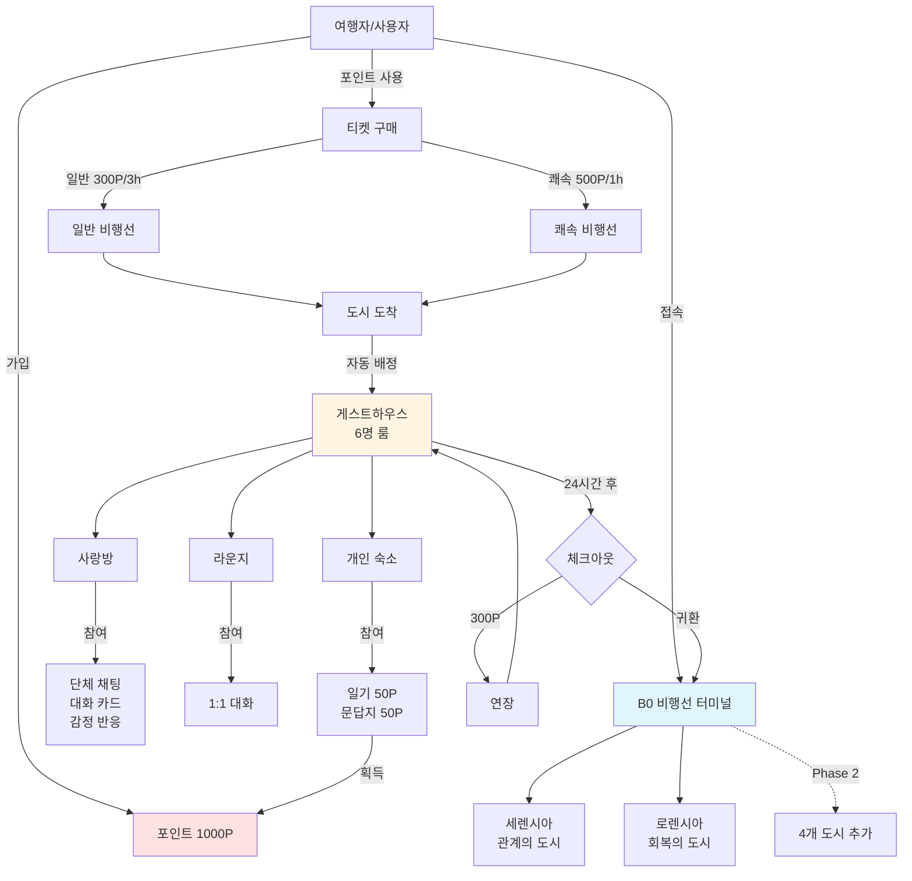
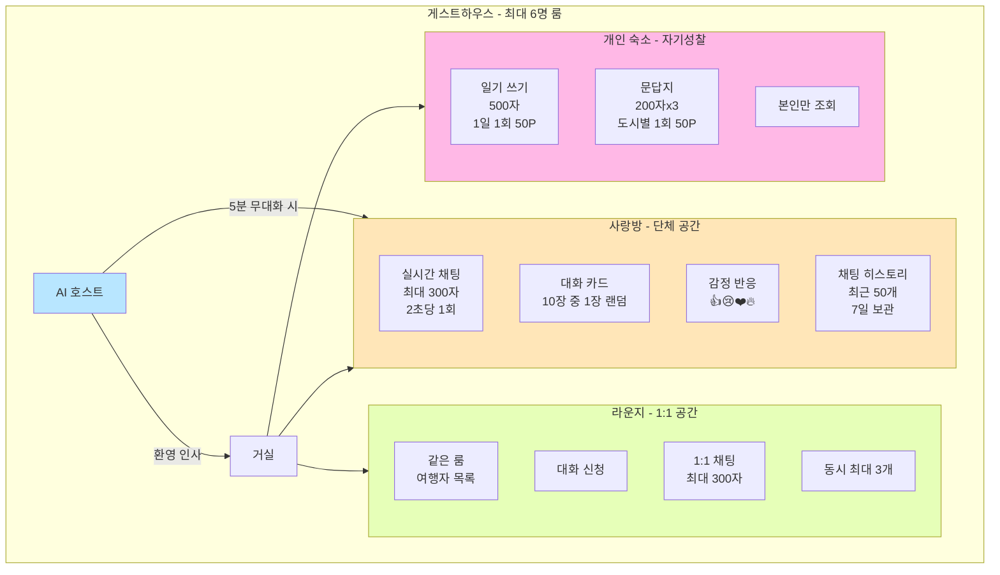
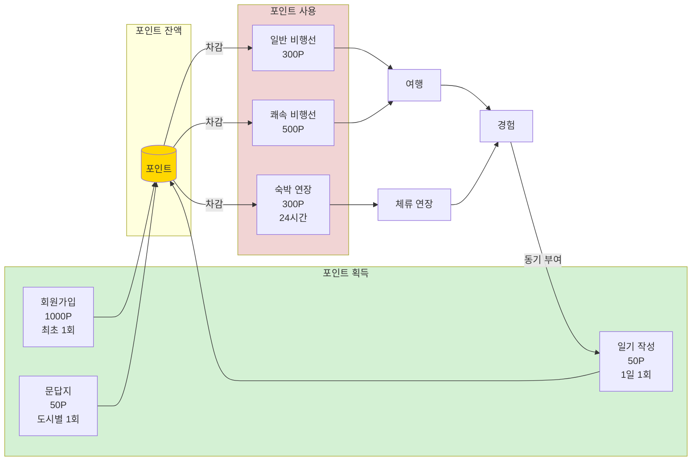
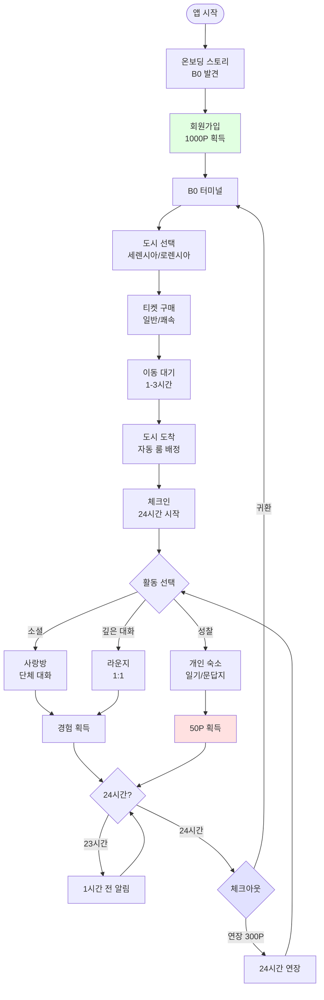

# B0 서비스 용어 및 정책 문서

## 🗺️ 0. 서비스 구조 다이어그램

### 0.1 전체 서비스 구조

### 0.2 게스트하우스 상세 구조

### 0.3 포인트 순환 구조

### 0.4 사용자 여정 플로우

## 📚 1. 용어 정의

### 1.1 세계관 및 기본 개념

#### B0 (지하 0층)

- **정의**: 현실 세계와 가상 세계를 연결하는 숨겨진 공간으로, 존재하지 않는 층을 의미
- **역할**: 여러 이세계 도시로 가는 비행선이 출발하는 터미널
- **발견**: 사용자가 방에서 발견한 신비한 핸드폰의 앱을 통해 접근

#### 여행자

- **정의**: B0 서비스를 이용하는 사용자의 서비스 내 정체성
- **속성**: 닉네임, 프로필 이모지, 포인트 보유

#### 비행선

- **정의**: B0 터미널에서 각 도시로 이동하는 교통수단
- **종류**:
    - 일반 비행선: 300포인트, 3시간 소요
    - 쾌속 비행선: 500포인트, 1시간 소요

#### 도시

- **정의**: 특정 테마를 가진 가상 세계의 목적지
- **MVP 제공 도시**:
    - **세렌시아**: 관계의 도시
    - **로렌시아**: 회복의 도시
- **Phase 2 예정 도시**: 4개 추가 (총 6개 도시)

---

### 1.2 공간 구조

#### 게스트하우스

- **정의**: 각 도시에서 여행자들이 머무르며 다른 여행자들과 교류하는 숙소
- **구성**: 거실, 사랑방, 라운지, 개인 숙소
- **룸 시스템**: 최대 6명까지 같은 룸에 자동 배정 (사용자에게는 룸 번호 비공개)

#### 사랑방

- **정의**: 같은 게스트하우스(룸)에 머무는 여행자들(최대 6명)이 함께 대화하는 단체 채팅 공간
- **기능**: 실시간 채팅, 대화 카드 사용, 감정 반응

#### 라운지

- **정의**: 같은 게스트하우스에 머무는 여행자들 간 1:1 대화를 나눌 수 있는 공간
- **제한**: 동시 최대 3개의 1:1 대화 가능

#### 개인 숙소

- **정의**: 여행자 혼자만의 공간으로, 자기성찰 활동을 수행하는 곳
- **기능**: 일기 쓰기, 문답지 작성
- **프라이버시**: 모든 활동은 본인만 조회 가능

---

### 1.3 시스템 요소

#### 포인트 (P)

- **정의**: 서비스 내에서 비행선 티켓 구매 및 숙박 연장에 사용되는 가상 화폐
- **획득 방법**:
    - 회원가입: 1,000P (최초 1회)
    - 일기 작성: 50P (하루 1회)
    - 문답지 완료: 50P (도시별 1회)
- **사용처**:
    - 일반 비행선: 300P
    - 쾌속 비행선: 500P
    - 숙박 연장: 300P (24시간)

#### 티켓

- **정의**: 비행선 탑승을 위해 필요한 증표
- **표시 정보**: 출발지(B0), 도착지(도시명), 비행선 번호, 도착 예정 시간

#### 체크인/체크아웃

- **체크인**: 비행선이 도시에 도착하여 게스트하우스 룸에 배정되는 시점
- **체크아웃**: 체크인 후 24시간 경과 시 발생하는 자동 퇴실 프로세스
- **연장**: 300P를 지불하여 24시간 추가 체류 가능

---

### 1.4 커뮤니케이션 요소

#### AI 호스트

- **정의**: 게스트하우스에서 여행자들을 환영하고 대화를 촉진하는 인공지능 캐릭터
- **역할**:
    - 입장 시 환영 인사
    - 5분간 대화 없을 시 대화 촉진 질문 제시
- **기술**: Ollama 기반 자연어 생성

#### 대화 카드

- **정의**: 사랑방에서 대화를 시작하거나 이어가기 위한 질문 카드
- **사용**: 10장 중 무작위 1장 추출, 사랑방에 공유 가능
- **예시**: "요즘 내가 웃었던 순간은?", "최근에 누군가와 나눈 의미 있는 대화는?"

#### 감정 반응

- **정의**: 사랑방 메시지에 대한 간단한 감정 표현 방식
- **종류**: 👍 😢 ❤️ 🔥
- **표시**: 메시지 옆에 "❤️ 3" 형태로 집계 표시

#### 채팅 히스토리

- **정의**: 사랑방의 과거 대화 기록
- **로드**: 입장 시 최근 50개 메시지 자동 로드
- **보관 기간**: 7일 (3일 이전 메시지 자동 삭제)

---

### 1.5 자기성찰 활동

#### 일기

- **정의**: 개인 숙소에서 작성하는 하루의 기록
- **구성**: 제목(선택), 본문(최대 500자), 기분 선택
- **보상**: 50P (하루 1회)
- **공개 범위**: 본인만 조회 가능

#### 문답지

- **정의**: 각 도시의 테마에 맞는 자기성찰 질문에 답변하는 활동
- **구성**: 도시별 3개 질문, 각 질문당 최대 200자 답변
- **보상**: 50P (도시별 1회)
- **공개 범위**: 본인만 조회 가능

---

## 📋 2. 정책

### 2.1 회원 관리 정책

#### 회원가입

- 이메일 기반 가입 (중복 불가)
- 이메일 인증 생략 (MVP 간소화)
- 닉네임: 2-10자, 중복 불가, 욕설 필터링 적용
- 비밀번호: 최소 8자 이상
- 프로필 이모지: 10종 중 필수 선택
- 가입 완료 시 1,000포인트 자동 지급

#### 로그인

- 이메일 + 비밀번호 방식
- 비밀번호 찾기/재설정 기능: Phase 2 제공 예정

#### 회원 탈퇴

- Phase 2 제공 예정
- MVP에서는 관리자 문의 필요

---

### 2.2 포인트 정책

#### 획득 규칙

- **회원가입**: 1,000P (계정당 1회)
- **일기 작성**: 50P (1일 1회, 자정 기준 초기화)
- **문답지 완료**: 50P (도시별 1회, 3개 질문 모두 작성 시)

#### 사용 규칙

- **일반 비행선**: 300P 차감
- **쾌속 비행선**: 500P 차감
- **숙박 연장**: 300P 차감 (24시간 단위)

#### 제약사항

- 포인트 잔액은 음수가 될 수 없음
- 포인트 부족 시 거래 불가, 안내 메시지 표시
- 동일 활동으로 중복 포인트 획득 방지 (트랜잭션 처리)
- 포인트 양도/거래 불가

---

### 2.3 여행 및 이동 정책

#### 비행선 운영

- **일반 비행선**: 300P, 3시간 소요
- **쾌속 비행선**: 500P, 1시간 소요
- 티켓 구매 후 환불 불가
- 도착 시간에 자동으로 게스트하우스 화면 전환

#### 도시 이용

- MVP에서는 세렌시아, 로렌시아 2개 도시만 이용 가능
- 도시 간 이동 시 반드시 B0를 경유
- 동시에 여러 도시에 체류 불가

---

### 2.4 게스트하우스 정책

#### 룸 배정

- 도시별로 최대 6명까지 같은 룸에 자동 배정
- 6명 초과 시 새로운 룸 자동 생성
- 룸 번호는 사용자에게 비공개 (백엔드에서만 관리)
- 룸 선택 불가 (자동 배정만 지원)
- 동시 입장 시 Race Condition 방지 처리

#### 체류 기간

- 기본 체류: 체크인 후 24시간
- 23시간 경과 시: "1시간 후 체크아웃" 알림
- 24시간 경과 시: 체크아웃 팝업 (연장 또는 이동 선택)
- 연장 선택 시: 300P 차감, 24시간 추가 체류
- 미선택 시: 자동으로 B0로 복귀

---

### 2.5 커뮤니티 정책

#### 사랑방 (단체 채팅)

- **참여 인원**: 같은 룸의 여행자 (최대 6명)
- **메시지 제한**: 최대 300자
- **전송 제한**: 스팸 방지를 위해 2초당 1회
- **채팅 히스토리**: 최근 50개 메시지 로드, 7일 보관 (3일 이전 자동 삭제)
- **콘텐츠 필터링**: 욕설 및 부적절한 내용 자동 필터링
- **신고/차단**: Phase 2 제공 예정

#### 라운지 (1:1 대화)

- **대상**: 같은 게스트하우스 내 여행자만
- **동시 대화**: 최대 3개까지 가능
- **대화 신청**: 상대방 수락 필요
- **메시지 제한**: 최대 300자
- **기록 보관**: 체크아웃 시 자동 삭제 (저장되지 않음)

#### AI 호스트 개입

- 게스트하우스 입장 시 환영 메시지 자동 전송
- 사랑방에서 5분간 대화 없을 시 자동 질문 제시
- 대화가 활발한 경우 개입하지 않음
- 응답 시간: 2초 이내 목표
- AI 응답 실패 시 사전 정의된 기본 질문 사용

---

### 2.6 콘텐츠 정책

#### 일기

- 하루 1회 작성 가능 (포인트 획득 기준)
- 제목: 선택 사항
- 본문: 최대 500자
- 기분: 필수 선택 (😊😐😢😠🥰 등)
- 열람 권한: 작성자 본인만
- 과거 일기 조회: Phase 2 제공 예정

#### 문답지

- 도시별 3개 질문 제공
- 각 답변: 최대 200자
- 3개 모두 작성 후 제출 시 포인트 획득
- 도시별 1회만 작성 가능 (포인트 획득 기준)
- 열람 권한: 작성자 본인만
- 과거 문답지 조회: Phase 2 제공 예정

#### 대화 카드

- 10장 중 무작위 1장 추출
- 추출된 카드는 사랑방에 공유 가능
- 추출 제한 없음 (여러 번 뽑기 가능)

---

### 2.7 데이터 및 개인정보 정책

#### 수집 데이터

- **필수 수집**: 이메일, 비밀번호(암호화), 닉네임, 프로필 이모지
- **행동 데이터**: DAU, 도시별 방문 수, 평균 체류 시간, 채팅 활성도
- **비수집 항목**: 일기 내용, 문답지 답변, 채팅 메시지 내용

#### 데이터 보관

- 채팅 메시지: 7일 (3일 이전 자동 삭제)
- 1:1 대화: 체크아웃 시 즉시 삭제
- 일기/문답지: 계정 존재 기간 동안 보관
- 행동 데이터: 서비스 개선 목적으로 익명화하여 보관

#### 개인정보 보호

- 비밀번호: 단방향 암호화 저장
- 개인정보: 암호화하여 저장
- 민감 콘텐츠(일기, 문답지): 본인만 조회 가능
- 데이터 사용: 서비스 개선 목적으로만 사용

---

### 2.8 서비스 운영 정책

#### 기능 활성화 관리

- 대화 카드: 관리자가 ON/OFF 가능
- AI 호스트 빈도: 관리자가 조정 가능
- 기능 변경 사항은 즉시 반영

#### 제재 정책

- MVP에서는 최소한의 자동 필터링만 적용
- 신고/차단 기능: Phase 2 제공 예정
- 심각한 위반 시: 관리자 직접 개입 (임시 조치)

#### 서비스 안정성

- 동시 접속 처리: Race Condition 방지
- 트랜잭션 무결성: 포인트 중복 지급/차감 방지
- 시간 동기화: 서버 시간 기준 통일

---

## 🔄 3. 정책 매트릭스

| 용어     | 관련 정책           | 제약사항            | Phase 2 변경사항   |
|--------|-----------------|-----------------|----------------|
| 포인트    | 획득/사용 규칙, 음수 방지 | 중복 획득 방지        | 포인트 내역 조회 추가   |
| 비행선    | 운영 정책, 티켓 환불 불가 | 2종만 제공          | 추가 비행선 종류 검토   |
| 게스트하우스 | 룸 배정, 체류 기간     | 6명 제한, 24시간 기본  | 혼합형/조용한 방 구분   |
| 사랑방    | 커뮤니티 정책         | 300자, 2초/1회     | 신고/차단 기능       |
| 라운지    | 1:1 대화 정책       | 동시 3개, 저장 안 됨   | 대화 기록 선택 저장    |
| 일기     | 콘텐츠 정책          | 500자, 1일 1회 포인트 | 과거 일기 조회       |
| 문답지    | 콘텐츠 정책          | 200자x3, 도시별 1회  | 과거 문답지 조회      |
| AI 호스트 | 개입 규칙           | 5분 무대화 시        | 개입 빈도 고도화      |
| 회원가입   | 회원 관리           | 이메일 인증 생략       | 비밀번호 찾기, 회원 탈퇴 |

---

## 📌 4. 주요 제약사항 요약

### 시간 제약

- 비행선 이동 시간: 고정 (일반 3시간, 쾌속 1시간)
- 체크아웃: 24시간 후 자동
- 채팅 히스토리: 7일 보관
- 메시지 전송: 2초당 1회

### 인원 제약

- 게스트하우스 룸: 최대 6명
- 1:1 대화: 동시 최대 3개

### 콘텐츠 제약

- 채팅 메시지: 최대 300자
- 일기 본문: 최대 500자
- 문답지 답변: 각 최대 200자
- 닉네임: 2-10자

### 빈도 제약

- 일기 포인트: 1일 1회
- 문답지 포인트: 도시별 1회
- 회원가입 포인트: 계정당 1회

### 금액 제약

- 포인트 잔액: 음수 불가
- 티켓 환불: 불가
- 포인트 양도: 불가

---

## 📖 5. 용어 색인 (가나다순)

| 용어      | 영문                | 설명                | 관련 섹션 |
|---------|-------------------|-------------------|-------|
| B0      | Basement Zero     | 비행선 터미널 겸 시작점     | 1.1   |
| 개인 숙소   | Private Room      | 자기성찰 공간           | 1.2   |
| 게스트하우스  | Guesthouse        | 도시별 숙소 (6명 룸)     | 1.2   |
| 감정 반응   | Reaction          | 메시지 반응 (👍😢❤️🔥) | 1.4   |
| 도시      | City              | 테마별 목적지           | 1.1   |
| 대화 카드   | Conversation Card | 대화 촉진 질문 카드       | 1.4   |
| 라운지     | Lounge            | 1:1 대화 공간         | 1.2   |
| 로렌시아    | Laurensia         | 회복의 도시            | 1.1   |
| 룸       | Room              | 6명 단위 그룹 (비공개)    | 1.2   |
| 문답지     | Questionnaire     | 도시별 자기성찰 질문       | 1.5   |
| 비행선     | Airship           | B0-도시 간 이동 수단     | 1.1   |
| 사랑방     | Sarangbang        | 단체 채팅 공간          | 1.2   |
| 세렌시아    | Serensia          | 관계의 도시            | 1.1   |
| 여행자     | Traveler          | 서비스 사용자           | 1.1   |
| 일기      | Diary             | 하루 기록 (500자)      | 1.5   |
| 체크인     | Check-in          | 게스트하우스 입실         | 1.3   |
| 체크아웃    | Check-out         | 24시간 후 퇴실         | 1.3   |
| 채팅 히스토리 | Chat History      | 최근 50개 메시지        | 1.4   |
| 쾌속 비행선  | Express Airship   | 500P, 1시간         | 1.1   |
| 티켓      | Ticket            | 비행선 탑승권           | 1.3   |
| 포인트     | Point (P)         | 서비스 내 화폐          | 1.3   |
| AI 호스트  | AI Host           | 대화 촉진 AI          | 1.4   |

---

이 문서는 B0 MVP 개발을 위한 용어 및 정책의 기준이 되며, Phase 2 이후 확장 시 업데이트됩니다.

**문서 버전**: 1.0  
**최종 수정일**: 2025년 11월 7일  
**다음 검토 예정**: Phase 2 시작 시