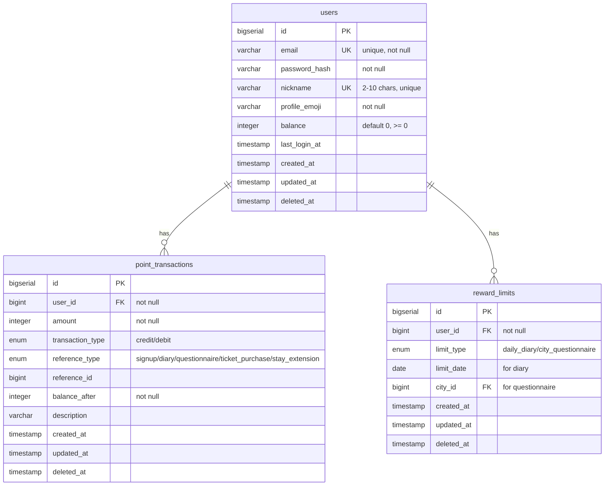
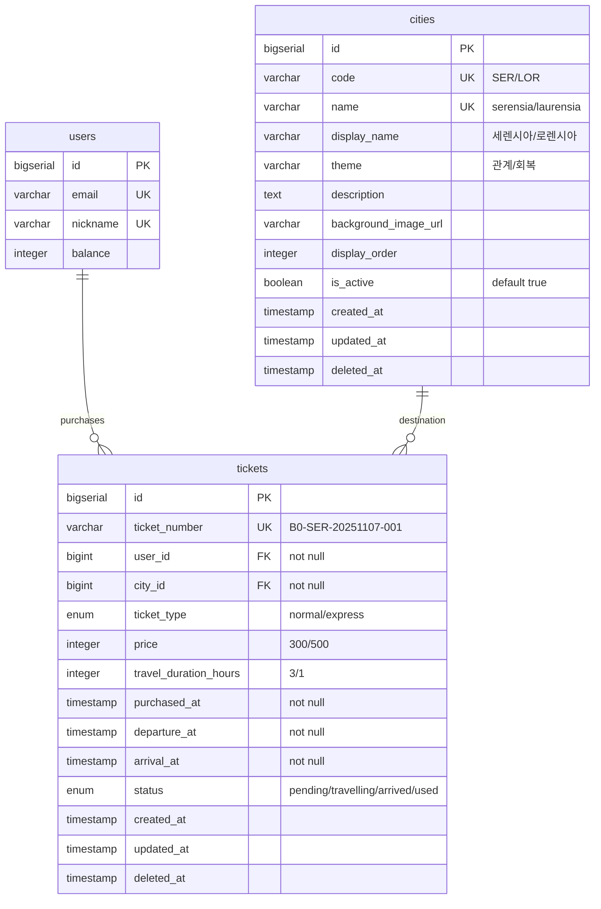
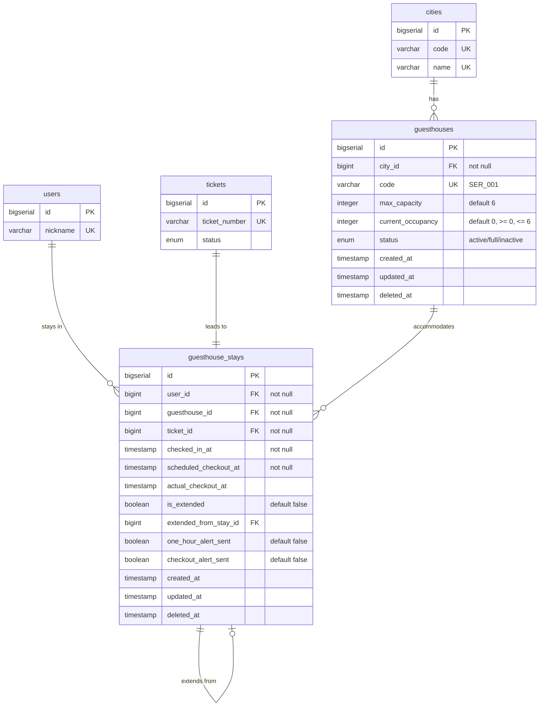
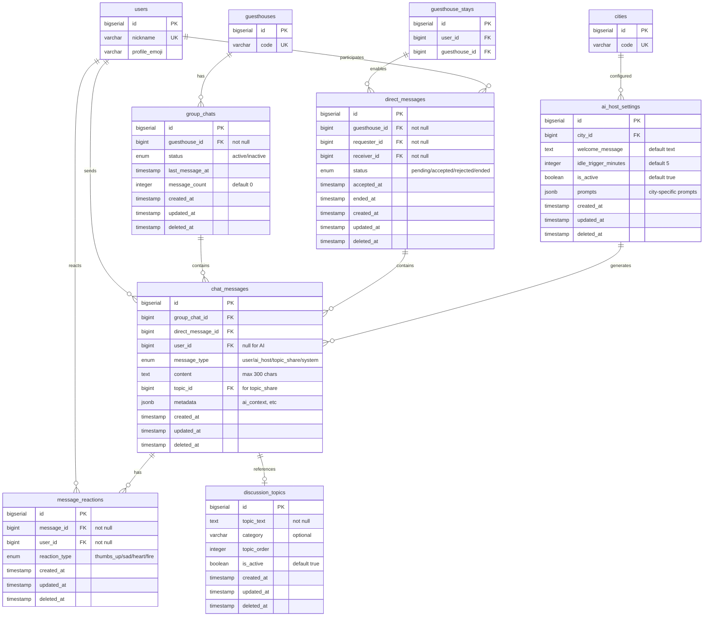
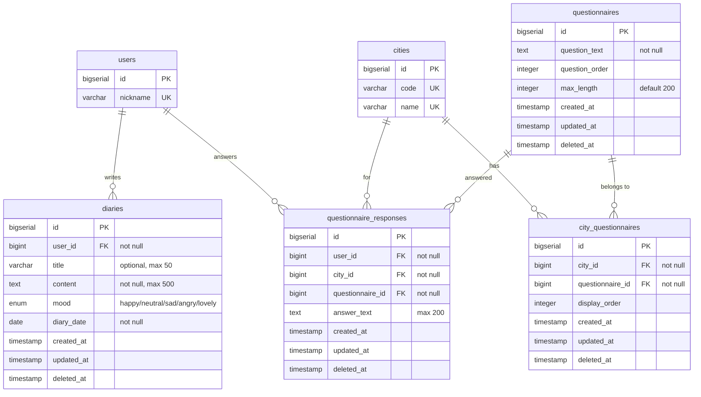

# B0 서비스 데이터베이스 설계 문서

## 📊 ERD (Entity Relationship Diagram)

```mermaid
erDiagram
    users ||--o{ point_transactions: "has"
    users ||--o{ reward_limits: "has"
    users ||--o{ tickets: "purchases"
    users ||--o{ guesthouse_stays: "assigned to"
    users ||--o{ chat_messages: "sends"
    users ||--o{ message_reactions: "reacts"
    users ||--o{ diaries: "writes"
    users ||--o{ questionnaire_responses: "answers"
    users ||--o{ direct_messages: "participates"
    cities ||--o{ tickets: "destination"
    cities ||--o{ guesthouses: "has"
    cities ||--o{ city_questionnaires: "has"
    cities ||--o{ questionnaire_responses: "for"
    cities ||--o{ ai_host_settings: "configured"
    cities ||--o{ reward_limits: "for"
    questionnaires ||--o{ city_questionnaires: "belongs to"
    questionnaires ||--o{ questionnaire_responses: "answered"
    tickets ||--|| guesthouse_stays: "leads to"
    guesthouses ||--o{ guesthouse_stays: "accommodates"
    guesthouses ||--o{ group_chats: "has"
    guesthouse_stays ||--o| guesthouse_stays: "extends from"
    guesthouse_stays ||--o{ direct_messages: "enables"
    group_chats ||--o{ chat_messages: "contains"
    direct_messages ||--o{ chat_messages: "contains"
    chat_messages ||--o{ message_reactions: "has"
    chat_messages ||--o| discussion_topics: "references"
    ai_host_settings ||--o{ chat_messages: "generates"

    users {
        bigserial id PK
        varchar email UK "unique, not null"
        varchar password_hash "not null"
        varchar nickname UK "2-10 chars, unique"
        varchar profile_emoji "not null"
        integer balance "default 0, >= 0"
        timestamp created_at
        timestamp updated_at
        timestamp deleted_at
    }

    point_transactions {
        bigserial id PK
        bigint user_id FK "not null"
        integer amount "not null"
        enum transaction_type "credit/debit"
        enum reference_type "signup/diary/questionnaire/ticket_purchase/stay_extension"
        bigint reference_id
        integer balance_after "not null"
        varchar description
        timestamp created_at
        timestamp updated_at
        timestamp deleted_at
    }

    reward_limits {
        bigserial id PK
        bigint user_id FK "not null"
        enum limit_type "daily_diary/city_questionnaire"
        date limit_date "for diary"
        bigint city_id FK "for questionnaire"
        timestamp created_at
        timestamp updated_at
        timestamp deleted_at
    }

    cities {
        bigserial id PK
        varchar code UK "SER/LOR"
        varchar name UK "serensia/laurensia"
        varchar display_name "세렌시아/로렌시아"
        varchar theme "관계/회복"
        text description
        varchar background_image_url
        integer display_order
        boolean is_active "default true"
        timestamp created_at
        timestamp updated_at
        timestamp deleted_at
    }

    questionnaires {
        bigserial id PK
        text question_text "not null"
        integer question_order
        integer max_length "default 200"
        timestamp created_at
        timestamp updated_at
        timestamp deleted_at
    }

    city_questionnaires {
        bigserial id PK
        bigint city_id FK "not null"
        bigint questionnaire_id FK "not null"
        integer display_order
        timestamp created_at
        timestamp updated_at
        timestamp deleted_at
    }

    tickets {
        bigserial id PK
        varchar ticket_number UK "B0-SER-20251107-001"
        bigint user_id FK "not null"
        bigint city_id FK "not null"
        enum ticket_type "normal/express"
        integer price "300/500"
        integer travel_duration_hours "3/1"
        timestamp purchased_at "not null"
        timestamp departure_at "not null"
        timestamp arrival_at "not null"
        enum status "pending/travelling/arrived/used"
        timestamp created_at
        timestamp updated_at
        timestamp deleted_at
    }

    guesthouses {
        bigserial id PK
        bigint city_id FK "not null"
        varchar code UK "SER_001"
        integer max_capacity "default 6"
        integer current_occupancy "default 0, >= 0, <= 6"
        enum status "active/full/inactive"
        timestamp created_at
        timestamp updated_at
        timestamp deleted_at
    }

    guesthouse_stays {
        bigserial id PK
        bigint user_id FK "not null"
        bigint guesthouse_id FK "not null"
        bigint ticket_id FK "not null"
        timestamp checked_in_at "not null"
        timestamp scheduled_checkout_at "not null"
        timestamp actual_checkout_at
        boolean is_extended "default false"
        bigint extended_from_stay_id FK
        boolean one_hour_alert_sent "default false"
        boolean checkout_alert_sent "default false"
        timestamp created_at
        timestamp updated_at
        timestamp deleted_at
    }

    group_chats {
        bigserial id PK
        bigint guesthouse_id FK "not null"
        enum status "active/inactive"
        timestamp last_message_at
        integer message_count "default 0"
        timestamp created_at
        timestamp updated_at
        timestamp deleted_at
    }

    direct_messages {
        bigserial id PK
        bigint guesthouse_id FK "not null"
        bigint requester_id FK "not null"
        bigint receiver_id FK "not null"
        enum status "pending/accepted/rejected/ended"
        timestamp accepted_at
        timestamp ended_at
        timestamp created_at
        timestamp updated_at
        timestamp deleted_at
    }

    chat_messages {
        bigserial id PK
        bigint group_chat_id FK
        bigint direct_message_id FK
        bigint user_id FK "null for AI"
        enum message_type "user/ai_host/topic_share/system"
        text content "max 300 chars"
        bigint topic_id FK "for topic_share"
        jsonb metadata "ai_context, etc"
        timestamp created_at
        timestamp updated_at
        timestamp deleted_at
    }

    message_reactions {
        bigserial id PK
        bigint message_id FK "not null"
        bigint user_id FK "not null"
        enum reaction_type "thumbs_up/sad/heart/fire"
        timestamp created_at
        timestamp updated_at
        timestamp deleted_at
    }

    discussion_topics {
        bigserial id PK
        text topic_text "not null"
        varchar category "optional"
        integer topic_order
        boolean is_active "default true"
        timestamp created_at
        timestamp updated_at
        timestamp deleted_at
    }

    ai_host_settings {
        bigserial id PK
        bigint city_id FK
        text welcome_message "default text"
        integer idle_trigger_minutes "default 5"
        boolean is_active "default true"
        jsonb prompts "city-specific prompts"
        timestamp created_at
        timestamp updated_at
        timestamp deleted_at
    }

    diaries {
        bigserial id PK
        bigint user_id FK "not null"
        varchar title "optional, max 50"
        text content "not null, max 500"
        enum mood "happy/neutral/sad/angry/lovely"
        date diary_date "not null"
        timestamp created_at
        timestamp updated_at
        timestamp deleted_at
    }

    questionnaire_responses {
        bigserial id PK
        bigint user_id FK "not null"
        bigint city_id FK "not null"
        bigint questionnaire_id FK "not null"
        text answer_text "max 200"
        timestamp created_at
        timestamp updated_at
        timestamp deleted_at
    }
```



## 📊 도메인별 ERD

### 1. 사용자 & 포인트 시스템



**핵심 개념**

- 사용자 기본 정보 및 포인트 잔액 관리
- 모든 포인트 거래 내역 추적 (획득/사용)
- 중복 보상 방지를 위한 제한 관리

---

### 2. 도시 & 여행 시스템



**핵심 개념**

- B0에서 각 도시로 이동하는 비행선 티켓
- 일반/쾌속 비행선 구분 (가격, 시간 차이)
- 티켓 상태 추적 (구매→여행중→도착→사용완료)

---

### 3. 게스트하우스 & 숙박 시스템



**핵심 개념**

- 도시별 게스트하우스 (최대 6명 룸)
- 체크인/체크아웃 관리 (기본 24시간)
- 숙박 연장 관계 추적
- 알림 발송 상태 관리

---

### 4. 커뮤니케이션 시스템 (사랑방/라운지/AI)



**핵심 개념**

- **사랑방**: 같은 게스트하우스 내 단체 채팅 (group_chats)
- **라운지**: 같은 게스트하우스 사용자 간 1:1 대화 (direct_messages)
- **대화 카드**: 대화 촉진 주제 (discussion_topics)
- **감정 반응**: 메시지에 대한 리액션 (👍😢❤️🔥)
- **AI 호스트**: 도시별 AI 설정 및 자동 메시지

---

### 5. 자기성찰 시스템 (일기/문답지)



**핵심 개념**

- **일기**: 개인의 하루 기록 (하루 1회 50P)
- **문답지**: 도시별 자기성찰 질문 (3개 질문, 도시별 1회 50P)
- 질문은 여러 도시에 공통으로 사용 가능 (city_questionnaires 중간 테이블)
- 모든 콘텐츠는 본인만 조회 가능

---

## 📋 도메인 간 관계 요약

| 출발 도메인          | → | 연결 도메인      | 관계             |
|-----------------|---|-------------|----------------|
| **사용자 & 포인트**   | → | 도시 & 여행     | 포인트로 티켓 구매     |
| **도시 & 여행**     | → | 게스트하우스 & 숙박 | 티켓이 숙박으로 전환    |
| **게스트하우스 & 숙박** | → | 커뮤니케이션      | 같은 룸 내에서 대화 가능 |
| **게스트하우스 & 숙박** | → | 자기성찰        | 숙박 중 일기/문답지 작성 |
| **자기성찰**        | → | 사용자 & 포인트   | 활동 완료 시 포인트 획득 |

## DDL

```postgresql
-- =====================================================
-- B0 (지하 0층) 서비스 데이터베이스 DDL
-- Version: 1.0
-- Created: 2025-11-07
-- Description: MVP Phase 1 전체 데이터베이스 스키마
-- =====================================================

-- =====================================================
-- 1. Extension 설치
-- =====================================================

-- UUID 생성을 위한 확장 (필요시)
CREATE EXTENSION IF NOT EXISTS "uuid-ossp";

-- =====================================================
-- 2. ENUM 타입 생성
-- =====================================================

-- 포인트 거래 타입
CREATE TYPE transaction_type_enum AS ENUM ('credit', 'debit');

-- 포인트 거래 참조 타입
CREATE TYPE reference_type_enum AS ENUM (
    'signup',
    'diary',
    'questionnaire',
    'ticket_purchase',
    'stay_extension'
);

-- 보상 제한 타입
CREATE TYPE limit_type_enum AS ENUM (
    'daily_diary',
    'city_questionnaire'
);

-- 티켓 타입
CREATE TYPE ticket_type_enum AS ENUM ('normal', 'express');

-- 티켓 상태
CREATE TYPE ticket_status_enum AS ENUM (
    'pending',
    'travelling',
    'arrived',
    'used'
);

-- 게스트하우스 상태
CREATE TYPE guesthouse_status_enum AS ENUM (
    'active',
    'full',
    'inactive'
);

-- 그룹 채팅 상태
CREATE TYPE chat_status_enum AS ENUM ('active', 'inactive');

-- 직접 메시지 상태
CREATE TYPE dm_status_enum AS ENUM (
    'pending',
    'accepted',
    'rejected',
    'ended'
);

-- 메시지 타입
CREATE TYPE message_type_enum AS ENUM (
    'user',
    'ai_host',
    'topic_share',
    'system'
);

-- 감정 반응 타입
CREATE TYPE reaction_type_enum AS ENUM (
    'thumbs_up',
    'sad',
    'heart',
    'fire'
);

-- 일기 기분
CREATE TYPE mood_enum AS ENUM (
    'happy',
    'neutral',
    'sad',
    'angry',
    'lovely'
);

-- =====================================================
-- 3. 테이블 생성 (의존성 순서대로)
-- =====================================================

-- -----------------------------------------------------
-- 3.1 독립 테이블 (FK 없음)
-- -----------------------------------------------------

-- users 테이블: 사용자 정보
CREATE TABLE users (
    id BIGSERIAL PRIMARY KEY,
    email VARCHAR(255) NOT NULL UNIQUE,
    password_hash VARCHAR(255) NOT NULL,
    nickname VARCHAR(10) NOT NULL UNIQUE,
    profile_emoji VARCHAR(10) NOT NULL,
    balance INTEGER NOT NULL DEFAULT 0,
    last_login_at TIMESTAMP,
    created_at TIMESTAMP NOT NULL DEFAULT CURRENT_TIMESTAMP,
    updated_at TIMESTAMP NOT NULL DEFAULT CURRENT_TIMESTAMP,
    deleted_at TIMESTAMP,
    
    -- 제약조건
    CONSTRAINT chk_users_balance CHECK (balance >= 0),
    CONSTRAINT chk_users_nickname_length CHECK (char_length(nickname) BETWEEN 2 AND 10)
);


-- cities 테이블: 도시 정보
CREATE TABLE cities (
    id BIGSERIAL PRIMARY KEY,
    code VARCHAR(10) NOT NULL UNIQUE,
    name VARCHAR(50) NOT NULL UNIQUE,
    display_name VARCHAR(50) NOT NULL,
    theme VARCHAR(50) NOT NULL,
    description TEXT,
    background_image_url VARCHAR(255),
    display_order INTEGER NOT NULL DEFAULT 0,
    is_active BOOLEAN NOT NULL DEFAULT TRUE,
    created_at TIMESTAMP NOT NULL DEFAULT CURRENT_TIMESTAMP,
    updated_at TIMESTAMP NOT NULL DEFAULT CURRENT_TIMESTAMP,
    deleted_at TIMESTAMP
);


-- questionnaires 테이블: 문답지 질문
CREATE TABLE questionnaires (
    id BIGSERIAL PRIMARY KEY,
    question_text TEXT NOT NULL,
    question_order INTEGER,
    max_length INTEGER NOT NULL DEFAULT 200,
    created_at TIMESTAMP NOT NULL DEFAULT CURRENT_TIMESTAMP,
    updated_at TIMESTAMP NOT NULL DEFAULT CURRENT_TIMESTAMP,
    deleted_at TIMESTAMP
);


-- discussion_topics 테이블: 대화 카드 주제
CREATE TABLE discussion_topics (
    id BIGSERIAL PRIMARY KEY,
    topic_text TEXT NOT NULL,
    category VARCHAR(50),
    topic_order INTEGER,
    is_active BOOLEAN NOT NULL DEFAULT TRUE,
    created_at TIMESTAMP NOT NULL DEFAULT CURRENT_TIMESTAMP,
    updated_at TIMESTAMP NOT NULL DEFAULT CURRENT_TIMESTAMP,
    deleted_at TIMESTAMP
);


-- -----------------------------------------------------
-- 3.2 레벨 1 의존 테이블 (독립 테이블에만 의존)
-- -----------------------------------------------------

-- point_transactions 테이블: 포인트 거래 내역
CREATE TABLE point_transactions (
    id BIGSERIAL PRIMARY KEY,
    user_id BIGINT NOT NULL,
    amount INTEGER NOT NULL,
    transaction_type transaction_type_enum NOT NULL,
    reference_type reference_type_enum NOT NULL,
    reference_id BIGINT,
    balance_after INTEGER NOT NULL,
    description VARCHAR(255),
    created_at TIMESTAMP NOT NULL DEFAULT CURRENT_TIMESTAMP,
    updated_at TIMESTAMP NOT NULL DEFAULT CURRENT_TIMESTAMP,
    deleted_at TIMESTAMP,
    
    -- Foreign Key (나중에 추가)
    CONSTRAINT fk_point_trans_user FOREIGN KEY (user_id) 
        REFERENCES users(id) ON DELETE CASCADE
);


-- reward_limits 테이블: 보상 제한 추적
CREATE TABLE reward_limits (
    id BIGSERIAL PRIMARY KEY,
    user_id BIGINT NOT NULL,
    limit_type limit_type_enum NOT NULL,
    limit_date DATE,  -- daily_diary용
    city_id BIGINT,   -- city_questionnaire용
    created_at TIMESTAMP NOT NULL DEFAULT CURRENT_TIMESTAMP,
    updated_at TIMESTAMP NOT NULL DEFAULT CURRENT_TIMESTAMP,
    deleted_at TIMESTAMP,
    
    -- Foreign Keys (나중에 추가)
    CONSTRAINT fk_reward_limits_user FOREIGN KEY (user_id) 
        REFERENCES users(id) ON DELETE CASCADE,
    CONSTRAINT fk_reward_limits_city FOREIGN KEY (city_id) 
        REFERENCES cities(id) ON DELETE CASCADE,
    
    -- 제약조건: daily_diary는 limit_date 필수
    CONSTRAINT chk_reward_daily_date CHECK (
        (limit_type = 'daily_diary' AND limit_date IS NOT NULL AND city_id IS NULL) OR
        (limit_type = 'city_questionnaire' AND limit_date IS NULL AND city_id IS NOT NULL)
    )
);


-- tickets 테이블: 비행선 티켓
CREATE TABLE tickets (
    id BIGSERIAL PRIMARY KEY,
    ticket_number VARCHAR(50) NOT NULL UNIQUE,
    user_id BIGINT NOT NULL,
    city_id BIGINT NOT NULL,
    ticket_type ticket_type_enum NOT NULL,
    price INTEGER NOT NULL,
    travel_duration_hours INTEGER NOT NULL,
    purchased_at TIMESTAMP NOT NULL,
    departure_at TIMESTAMP NOT NULL,
    arrival_at TIMESTAMP NOT NULL,
    status ticket_status_enum NOT NULL DEFAULT 'pending',
    created_at TIMESTAMP NOT NULL DEFAULT CURRENT_TIMESTAMP,
    updated_at TIMESTAMP NOT NULL DEFAULT CURRENT_TIMESTAMP,
    deleted_at TIMESTAMP,
    
    -- Foreign Keys
    CONSTRAINT fk_tickets_user FOREIGN KEY (user_id) 
        REFERENCES users(id) ON DELETE CASCADE,
    CONSTRAINT fk_tickets_city FOREIGN KEY (city_id) 
        REFERENCES cities(id) ON DELETE RESTRICT,
    
    -- 제약조건
    CONSTRAINT chk_tickets_price CHECK (price IN (300, 500)),
    CONSTRAINT chk_tickets_duration CHECK (travel_duration_hours IN (1, 3))
);


-- guesthouses 테이블: 게스트하우스 룸
CREATE TABLE guesthouses (
    id BIGSERIAL PRIMARY KEY,
    city_id BIGINT NOT NULL,
    code VARCHAR(20) NOT NULL UNIQUE,
    max_capacity INTEGER NOT NULL DEFAULT 6,
    current_occupancy INTEGER NOT NULL DEFAULT 0,
    status guesthouse_status_enum NOT NULL DEFAULT 'active',
    created_at TIMESTAMP NOT NULL DEFAULT CURRENT_TIMESTAMP,
    updated_at TIMESTAMP NOT NULL DEFAULT CURRENT_TIMESTAMP,
    deleted_at TIMESTAMP,
    
    -- Foreign Key
    CONSTRAINT fk_guesthouses_city FOREIGN KEY (city_id) 
        REFERENCES cities(id) ON DELETE CASCADE,
    
    -- 제약조건
    CONSTRAINT chk_guesthouses_occupancy CHECK (current_occupancy >= 0),
    CONSTRAINT chk_guesthouses_capacity CHECK (current_occupancy <= max_capacity)
);


-- city_questionnaires 테이블: 도시별 문답지 매핑
CREATE TABLE city_questionnaires (
    id BIGSERIAL PRIMARY KEY,
    city_id BIGINT NOT NULL,
    questionnaire_id BIGINT NOT NULL,
    display_order INTEGER NOT NULL DEFAULT 0,
    created_at TIMESTAMP NOT NULL DEFAULT CURRENT_TIMESTAMP,
    updated_at TIMESTAMP NOT NULL DEFAULT CURRENT_TIMESTAMP,
    deleted_at TIMESTAMP,
    
    -- Foreign Keys
    CONSTRAINT fk_city_quest_city FOREIGN KEY (city_id) 
        REFERENCES cities(id) ON DELETE CASCADE,
    CONSTRAINT fk_city_quest_question FOREIGN KEY (questionnaire_id) 
        REFERENCES questionnaires(id) ON DELETE CASCADE,
    
    -- Unique Constraint: 도시당 질문 중복 불가
    CONSTRAINT uq_city_questionnaire UNIQUE (city_id, questionnaire_id)
);


-- ai_host_settings 테이블: AI 호스트 설정
CREATE TABLE ai_host_settings (
    id BIGSERIAL PRIMARY KEY,
    city_id BIGINT,
    welcome_message TEXT,
    idle_trigger_minutes INTEGER NOT NULL DEFAULT 5,
    is_active BOOLEAN NOT NULL DEFAULT TRUE,
    prompts JSONB,  -- 도시별 프롬프트 템플릿
    created_at TIMESTAMP NOT NULL DEFAULT CURRENT_TIMESTAMP,
    updated_at TIMESTAMP NOT NULL DEFAULT CURRENT_TIMESTAMP,
    deleted_at TIMESTAMP,
    
    -- Foreign Key
    CONSTRAINT fk_ai_host_city FOREIGN KEY (city_id) 
        REFERENCES cities(id) ON DELETE CASCADE
);


-- diaries 테이블: 개인 일기
CREATE TABLE diaries (
    id BIGSERIAL PRIMARY KEY,
    user_id BIGINT NOT NULL,
    title VARCHAR(50),
    content TEXT NOT NULL,
    mood mood_enum NOT NULL,
    diary_date DATE NOT NULL,
    created_at TIMESTAMP NOT NULL DEFAULT CURRENT_TIMESTAMP,
    updated_at TIMESTAMP NOT NULL DEFAULT CURRENT_TIMESTAMP,
    deleted_at TIMESTAMP,
    
    -- Foreign Key
    CONSTRAINT fk_diaries_user FOREIGN KEY (user_id) 
        REFERENCES users(id) ON DELETE CASCADE,
    
    -- 제약조건
    CONSTRAINT chk_diaries_title_length CHECK (char_length(title) <= 50),
    CONSTRAINT chk_diaries_content_length CHECK (char_length(content) <= 500)
);


-- -----------------------------------------------------
-- 3.3 레벨 2 의존 테이블
-- -----------------------------------------------------

-- guesthouse_stays 테이블: 게스트하우스 숙박 기록
CREATE TABLE guesthouse_stays (
    id BIGSERIAL PRIMARY KEY,
    user_id BIGINT NOT NULL,
    guesthouse_id BIGINT NOT NULL,
    ticket_id BIGINT NOT NULL,
    checked_in_at TIMESTAMP NOT NULL,
    scheduled_checkout_at TIMESTAMP NOT NULL,
    actual_checkout_at TIMESTAMP,
    is_extended BOOLEAN NOT NULL DEFAULT FALSE,
    extended_from_stay_id BIGINT,  -- Self-referencing FK
    one_hour_alert_sent BOOLEAN NOT NULL DEFAULT FALSE,
    checkout_alert_sent BOOLEAN NOT NULL DEFAULT FALSE,
    created_at TIMESTAMP NOT NULL DEFAULT CURRENT_TIMESTAMP,
    updated_at TIMESTAMP NOT NULL DEFAULT CURRENT_TIMESTAMP,
    deleted_at TIMESTAMP,
    
    -- Foreign Keys
    CONSTRAINT fk_stays_user FOREIGN KEY (user_id) 
        REFERENCES users(id) ON DELETE CASCADE,
    CONSTRAINT fk_stays_guesthouse FOREIGN KEY (guesthouse_id) 
        REFERENCES guesthouses(id) ON DELETE CASCADE,
    CONSTRAINT fk_stays_ticket FOREIGN KEY (ticket_id) 
        REFERENCES tickets(id) ON DELETE RESTRICT,
    CONSTRAINT fk_stays_extended_from FOREIGN KEY (extended_from_stay_id) 
        REFERENCES guesthouse_stays(id) ON DELETE SET NULL
);


-- group_chats 테이블: 사랑방 (단체 채팅)
CREATE TABLE group_chats (
    id BIGSERIAL PRIMARY KEY,
    guesthouse_id BIGINT NOT NULL,
    status chat_status_enum NOT NULL DEFAULT 'active',
    last_message_at TIMESTAMP,
    message_count INTEGER NOT NULL DEFAULT 0,
    created_at TIMESTAMP NOT NULL DEFAULT CURRENT_TIMESTAMP,
    updated_at TIMESTAMP NOT NULL DEFAULT CURRENT_TIMESTAMP,
    deleted_at TIMESTAMP,
    
    -- Foreign Key
    CONSTRAINT fk_group_chats_guesthouse FOREIGN KEY (guesthouse_id) 
        REFERENCES guesthouses(id) ON DELETE CASCADE
);


-- direct_messages 테이블: 라운지 (1:1 대화)
CREATE TABLE direct_messages (
    id BIGSERIAL PRIMARY KEY,
    guesthouse_id BIGINT NOT NULL,
    requester_id BIGINT NOT NULL,
    receiver_id BIGINT NOT NULL,
    status dm_status_enum NOT NULL DEFAULT 'pending',
    accepted_at TIMESTAMP,
    ended_at TIMESTAMP,
    created_at TIMESTAMP NOT NULL DEFAULT CURRENT_TIMESTAMP,
    updated_at TIMESTAMP NOT NULL DEFAULT CURRENT_TIMESTAMP,
    deleted_at TIMESTAMP,
    
    -- Foreign Keys
    CONSTRAINT fk_dm_guesthouse FOREIGN KEY (guesthouse_id) 
        REFERENCES guesthouses(id) ON DELETE CASCADE,
    CONSTRAINT fk_dm_requester FOREIGN KEY (requester_id) 
        REFERENCES users(id) ON DELETE CASCADE,
    CONSTRAINT fk_dm_receiver FOREIGN KEY (receiver_id) 
        REFERENCES users(id) ON DELETE CASCADE,
    
    -- 제약조건: 자기 자신과 대화 불가
    CONSTRAINT chk_dm_different_users CHECK (requester_id != receiver_id)
);


-- questionnaire_responses 테이블: 문답지 응답
CREATE TABLE questionnaire_responses (
    id BIGSERIAL PRIMARY KEY,
    user_id BIGINT NOT NULL,
    city_id BIGINT NOT NULL,
    questionnaire_id BIGINT NOT NULL,
    answer_text TEXT,
    created_at TIMESTAMP NOT NULL DEFAULT CURRENT_TIMESTAMP,
    updated_at TIMESTAMP NOT NULL DEFAULT CURRENT_TIMESTAMP,
    deleted_at TIMESTAMP,
    
    -- Foreign Keys
    CONSTRAINT fk_quest_resp_user FOREIGN KEY (user_id) 
        REFERENCES users(id) ON DELETE CASCADE,
    CONSTRAINT fk_quest_resp_city FOREIGN KEY (city_id) 
        REFERENCES cities(id) ON DELETE CASCADE,
    CONSTRAINT fk_quest_resp_question FOREIGN KEY (questionnaire_id) 
        REFERENCES questionnaires(id) ON DELETE CASCADE,
    
    -- 제약조건
    CONSTRAINT chk_quest_resp_length CHECK (char_length(answer_text) <= 200)
);


-- -----------------------------------------------------
-- 3.4 레벨 3 의존 테이블
-- -----------------------------------------------------

-- chat_messages 테이블: 채팅 메시지 (사랑방 + 라운지) - PARTITIONED
-- 3일 후 자동 삭제를 위해 일별 파티셔닝 적용
CREATE TABLE chat_messages (
    id BIGSERIAL,
    group_chat_id BIGINT,        -- 사랑방 메시지
    direct_message_id BIGINT,    -- 라운지 메시지
    user_id BIGINT,              -- NULL이면 AI 호스트
    message_type message_type_enum NOT NULL,
    content JSONB,
    topic_id BIGINT,             -- 대화 카드 참조
    metadata JSONB,              -- AI 컨텍스트 등
    created_at TIMESTAMP NOT NULL DEFAULT CURRENT_TIMESTAMP,
    updated_at TIMESTAMP NOT NULL DEFAULT CURRENT_TIMESTAMP,
    deleted_at TIMESTAMP,
    
    -- Primary Key에 파티션 키 포함 필수
    PRIMARY KEY (id, created_at),
    
    -- Foreign Keys
    CONSTRAINT fk_chat_msg_group FOREIGN KEY (group_chat_id) 
        REFERENCES group_chats(id) ON DELETE CASCADE,
    CONSTRAINT fk_chat_msg_dm FOREIGN KEY (direct_message_id) 
        REFERENCES direct_messages(id) ON DELETE CASCADE,
    CONSTRAINT fk_chat_msg_user FOREIGN KEY (user_id) 
        REFERENCES users(id) ON DELETE SET NULL,
    CONSTRAINT fk_chat_msg_topic FOREIGN KEY (topic_id) 
        REFERENCES discussion_topics(id) ON DELETE SET NULL,
    
    -- 제약조건: group_chat_id와 direct_message_id 중 정확히 하나만 있어야 함 (XOR)
    CONSTRAINT chk_chat_msg_xor CHECK (
        (group_chat_id IS NOT NULL AND direct_message_id IS NULL) OR
        (group_chat_id IS NULL AND direct_message_id IS NOT NULL)
    ),
    CONSTRAINT chk_chat_msg_content_length CHECK (char_length(content) <= 300)
) PARTITION BY RANGE (created_at);


-- 초기 파티션 생성 (오늘 기준 7일치)
-- Default 파티션 (범위 밖 데이터용)
CREATE TABLE chat_messages_default PARTITION OF chat_messages DEFAULT;

-- 실제 날짜는 배포 시점에 맞게 조정 필요
-- 아래는 예시 (2025-11-07 ~ 2025-11-13)
DO $$
DECLARE
    partition_date DATE;
    partition_name TEXT;
    start_date TEXT;
    end_date TEXT;
BEGIN
    -- 향후 7일치 파티션 생성
    FOR i IN 0..6 LOOP
        partition_date := CURRENT_DATE + (i || ' days')::INTERVAL;
        partition_name := 'chat_messages_' || to_char(partition_date, 'YYYY_MM_DD');
        start_date := to_char(partition_date, 'YYYY-MM-DD');
        end_date := to_char(partition_date + INTERVAL '1 day', 'YYYY-MM-DD');
        
        EXECUTE format(
            'CREATE TABLE IF NOT EXISTS %I PARTITION OF chat_messages FOR VALUES FROM (%L) TO (%L)',
            partition_name, start_date, end_date
        );
        RAISE NOTICE 'Created partition: %', partition_name;
    END LOOP;
END $$;

-- message_reactions 테이블: 메시지 감정 반응
CREATE TABLE message_reactions (
    id BIGSERIAL PRIMARY KEY,
    message_id BIGINT NOT NULL,
    message_created_at TIMESTAMP NOT NULL,  -- 파티션 키 참조용
    user_id BIGINT NOT NULL,
    reaction_type reaction_type_enum NOT NULL,
    created_at TIMESTAMP NOT NULL DEFAULT CURRENT_TIMESTAMP,
    updated_at TIMESTAMP NOT NULL DEFAULT CURRENT_TIMESTAMP,
    deleted_at TIMESTAMP,
    
    -- Foreign Key는 (id, created_at) 조합으로
    CONSTRAINT fk_reaction_message FOREIGN KEY (message_id, message_created_at) 
        REFERENCES chat_messages(id, created_at) ON DELETE CASCADE,
    CONSTRAINT fk_reaction_user FOREIGN KEY (user_id) 
        REFERENCES users(id) ON DELETE CASCADE,
    
    -- Unique Constraint: 메시지당 사용자당 반응 타입은 1개만
    CONSTRAINT uq_message_user_reaction UNIQUE (message_id, user_id, reaction_type)
);


-- =====================================================
-- 4. 인덱스 생성
-- =====================================================

-- users 테이블 인덱스
CREATE INDEX idx_users_email ON users(email);
CREATE INDEX idx_users_nickname ON users(nickname);
CREATE INDEX idx_users_deleted_at ON users(deleted_at);

-- point_transactions 테이블 인덱스
CREATE INDEX idx_point_trans_user_id ON point_transactions(user_id);
CREATE INDEX idx_point_trans_created_at ON point_transactions(created_at DESC);
CREATE INDEX idx_point_trans_reference ON point_transactions(reference_type, reference_id);

-- reward_limits 테이블 인덱스
CREATE INDEX idx_reward_limits_user_date ON reward_limits(user_id, limit_date);
CREATE INDEX idx_reward_limits_user_city ON reward_limits(user_id, city_id);
CREATE INDEX idx_reward_limits_type ON reward_limits(limit_type);

-- tickets 테이블 인덱스
CREATE INDEX idx_tickets_user_id ON tickets(user_id);
CREATE INDEX idx_tickets_city_id ON tickets(city_id);
CREATE INDEX idx_tickets_status ON tickets(status);
CREATE INDEX idx_tickets_arrival_at ON tickets(arrival_at);

-- guesthouses 테이블 인덱스
CREATE INDEX idx_guesthouses_city_id ON guesthouses(city_id);
CREATE INDEX idx_guesthouses_status ON guesthouses(status);
CREATE INDEX idx_guesthouses_occupancy ON guesthouses(current_occupancy);

-- guesthouse_stays 테이블 인덱스
CREATE INDEX idx_stays_user_id ON guesthouse_stays(user_id);
CREATE INDEX idx_stays_guesthouse_id ON guesthouse_stays(guesthouse_id);
CREATE INDEX idx_stays_checked_in_at ON guesthouse_stays(checked_in_at);
CREATE INDEX idx_stays_scheduled_checkout ON guesthouse_stays(scheduled_checkout_at);
CREATE INDEX idx_stays_active ON guesthouse_stays(guesthouse_id, actual_checkout_at) 
    WHERE actual_checkout_at IS NULL; -- 현재 체류 중인 사용자 조회용

-- group_chats 테이블 인덱스
CREATE INDEX idx_group_chats_guesthouse_id ON group_chats(guesthouse_id);
CREATE INDEX idx_group_chats_status ON group_chats(status);

-- direct_messages 테이블 인덱스
CREATE INDEX idx_dm_guesthouse_id ON direct_messages(guesthouse_id);
CREATE INDEX idx_dm_requester_id ON direct_messages(requester_id);
CREATE INDEX idx_dm_receiver_id ON direct_messages(receiver_id);
CREATE INDEX idx_dm_status ON direct_messages(status);

-- chat_messages 테이블 인덱스 (자동으로 모든 파티션에 적용됨)
CREATE INDEX idx_chat_msg_group_chat_id ON chat_messages(group_chat_id, created_at);
CREATE INDEX idx_chat_msg_dm_id ON chat_messages(direct_message_id, created_at);
CREATE INDEX idx_chat_msg_user_id ON chat_messages(user_id);
CREATE INDEX idx_chat_msg_created_at ON chat_messages(created_at DESC); -- 최근 50개 조회용
CREATE INDEX idx_chat_msg_type ON chat_messages(message_type);

-- message_reactions 테이블 인덱스
CREATE INDEX idx_reactions_message_id ON message_reactions(message_id);
CREATE INDEX idx_reactions_message_created ON message_reactions(message_id, message_created_at);
CREATE INDEX idx_reactions_user_id ON message_reactions(user_id);

-- diaries 테이블 인덱스
CREATE INDEX idx_diaries_user_id ON diaries(user_id);
CREATE INDEX idx_diaries_user_date ON diaries(user_id, diary_date DESC);

-- questionnaire_responses 테이블 인덱스
CREATE INDEX idx_quest_resp_user_id ON questionnaire_responses(user_id);
CREATE INDEX idx_quest_resp_city_id ON questionnaire_responses(city_id);
CREATE INDEX idx_quest_resp_user_city ON questionnaire_responses(user_id, city_id);

-- city_questionnaires 테이블 인덱스
CREATE INDEX idx_city_quest_city_id ON city_questionnaires(city_id);
CREATE INDEX idx_city_quest_display_order ON city_questionnaires(city_id, display_order);

-- =====================================================
-- 5. 추가 Unique Constraints
-- =====================================================

-- reward_limits: 사용자당 날짜별 일기는 1개만
CREATE UNIQUE INDEX uq_reward_daily_diary 
    ON reward_limits(user_id, limit_date) 
    WHERE limit_type = 'daily_diary' AND deleted_at IS NULL;

-- reward_limits: 사용자당 도시별 문답지는 1개만
CREATE UNIQUE INDEX uq_reward_city_quest 
    ON reward_limits(user_id, city_id) 
    WHERE limit_type = 'city_questionnaire' AND deleted_at IS NULL;

-- =====================================================
-- 6. 트리거 생성 (updated_at 자동 업데이트)
-- =====================================================

-- updated_at 자동 업데이트 함수
CREATE OR REPLACE FUNCTION update_updated_at_column()
RETURNS TRIGGER AS $$
BEGIN
    NEW.updated_at = CURRENT_TIMESTAMP;
    RETURN NEW;
END;
$$ language 'plpgsql';

-- 각 테이블에 트리거 적용
CREATE TRIGGER update_users_updated_at BEFORE UPDATE ON users
    FOR EACH ROW EXECUTE FUNCTION update_updated_at_column();

CREATE TRIGGER update_point_transactions_updated_at BEFORE UPDATE ON point_transactions
    FOR EACH ROW EXECUTE FUNCTION update_updated_at_column();

CREATE TRIGGER update_reward_limits_updated_at BEFORE UPDATE ON reward_limits
    FOR EACH ROW EXECUTE FUNCTION update_updated_at_column();

CREATE TRIGGER update_cities_updated_at BEFORE UPDATE ON cities
    FOR EACH ROW EXECUTE FUNCTION update_updated_at_column();

CREATE TRIGGER update_questionnaires_updated_at BEFORE UPDATE ON questionnaires
    FOR EACH ROW EXECUTE FUNCTION update_updated_at_column();

CREATE TRIGGER update_city_questionnaires_updated_at BEFORE UPDATE ON city_questionnaires
    FOR EACH ROW EXECUTE FUNCTION update_updated_at_column();

CREATE TRIGGER update_tickets_updated_at BEFORE UPDATE ON tickets
    FOR EACH ROW EXECUTE FUNCTION update_updated_at_column();

CREATE TRIGGER update_guesthouses_updated_at BEFORE UPDATE ON guesthouses
    FOR EACH ROW EXECUTE FUNCTION update_updated_at_column();

CREATE TRIGGER update_guesthouse_stays_updated_at BEFORE UPDATE ON guesthouse_stays
    FOR EACH ROW EXECUTE FUNCTION update_updated_at_column();

CREATE TRIGGER update_group_chats_updated_at BEFORE UPDATE ON group_chats
    FOR EACH ROW EXECUTE FUNCTION update_updated_at_column();

CREATE TRIGGER update_direct_messages_updated_at BEFORE UPDATE ON direct_messages
    FOR EACH ROW EXECUTE FUNCTION update_updated_at_column();

CREATE TRIGGER update_chat_messages_updated_at BEFORE UPDATE ON chat_messages
    FOR EACH ROW EXECUTE FUNCTION update_updated_at_column();

CREATE TRIGGER update_message_reactions_updated_at BEFORE UPDATE ON message_reactions
    FOR EACH ROW EXECUTE FUNCTION update_updated_at_column();

CREATE TRIGGER update_discussion_topics_updated_at BEFORE UPDATE ON discussion_topics
    FOR EACH ROW EXECUTE FUNCTION update_updated_at_column();

CREATE TRIGGER update_ai_host_settings_updated_at BEFORE UPDATE ON ai_host_settings
    FOR EACH ROW EXECUTE FUNCTION update_updated_at_column();

CREATE TRIGGER update_diaries_updated_at BEFORE UPDATE ON diaries
    FOR EACH ROW EXECUTE FUNCTION update_updated_at_column();

CREATE TRIGGER update_questionnaire_responses_updated_at BEFORE UPDATE ON questionnaire_responses
    FOR EACH ROW EXECUTE FUNCTION update_updated_at_column();
```